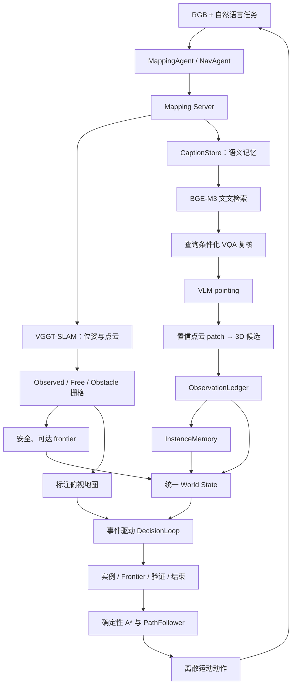

# VGGT-Nav Agent 当前架构

本文档描述仓库当前代码，而不是最初设计或未来计划。系统面向多目标具身导航任务，例如“找到 5 个杯子”或“找到所有篮子”。核心理念是：为决策 VLM 提供可靠的视觉感知、语义记忆、空间记忆和确定性执行能力，让 VLM 负责高层选择，而不是直接控制每一步运动。

## 1. 设计边界

决策 VLM 负责：

- 在已确认实例和可达 frontier 之间选择下一高层目标；
- 请求补充验证或继续探索；
- 到达目标附近后判断 `REPORT_FOUND / SCAN / REJECT`；
- 在 `all` 模式下建议是否结束。

确定性模块负责：

- RGB 输入、VGGT-SLAM 建图和相对位姿；
- 点云到占据栅格、frontier、A* 路径和路径跟随；
- pointing 像素到 3D 点的几何恢复；
- 实例去重、计数、belief/confirmed/visited/rejected 状态；
- 决策 JSON、动作 ID、`REPORT_FOUND` 和 `FINISH` 的合法性约束；
- VLM 不可用或输出非法时的保底行为。

系统不允许 VLM估计坐标、路径长度或直接输出 benchmark 电机动作。

## 2. 总体结构



主要模块：

| 模块 | 文件 | 职责 |
|---|---|---|
| 主状态机 | `agents/nav_agent.py` | 探索、导航、到达、扫描、报告与结束 |
| 决策状态 | `agents/decision_state.py` | 生成统一 JSON world state |
| 实例记忆 | `agents/memory.py` | confirmed/visited/rejected、空间合并与计数 |
| 观测账本 | `agents/evidence.py` | belief、多视角独立观测与 confirmed 升级 |
| 空间信念 | `agents/belief.py` | Caption 检索与 belief 锚点对 frontier 的语义引导 |
| 几何导航 | `agents/navigator.py` | 重力对齐、覆盖/占据栅格、A*、路径跟随 |
| Frontier | `agents/skeleton.py` | frontier 提取、聚类、安全代表点和信息增益 |
| 决策循环 | `decision/agent_loop.py` | Prompt、工具循环、schema/ID/结束校验 |
| VLM 传输 | `decision/vlm.py` | OpenAI-compatible 请求与图像编码 |
| 建图服务 | `mapping/server.py` | VGGT-SLAM、Caption、Pointing 与 3D 恢复 |
| Caption 记忆 | `mapping/caption_store.py` | 异步 caption、持久化、BGE-M3 检索 |
| Pointing | `mapping/pointing.py` | 属性复核、多实例像素定位、深度 patch 采样 |
| VLM 网关 | `mapping/vllm_client.py` | pointing/caption 请求、缓存与优先级队列 |

## 3. 感知与语义记忆

### 3.1 建图

Agent 持续把 RGB 帧发送到 Mapping Server。服务端进行关键帧筛选、VGGT 子图推理和因子图优化，向 Agent 提供：

- 所有关键帧位姿；
- 全局点云；
- 带图像行号和位姿的逐帧点云；
- 相机内参和关键帧图像。

所有几何均来自 Agent 可用的 RGB 推断结果，不读取 benchmark 真值深度、GPS、Compass 或语义 ID。

### 3.2 Semantic-memory 主链路

当前语义记忆链路为：

```text
关键帧 RGB
→ 异步生成查询无关 caption
→ BGE-M3 编码并按 episode 持久化
→ 使用完整目标文本检索 top-K caption
→ 对候选帧逐条进行属性/关系 VQA 复核
→ VLM pointing 输出一个或多个像素与 bbox
→ 在 VGGT 高置信点云 patch 中采样中位 3D 点
→ 注册可随图优化重新解析的 candidate_id
```

Caption worker 是低优先级异步任务，不应阻塞建图。Pointing 和 VQA失败时返回空结果，由 Agent 继续探索。

### 3.3 当前兼容分支

`mapping/server.py` 仍保留 CLIP 检索与 SAM3 分割实现，并通过 `NAV_SEMANTIC_BACKEND` 分流。这是当前代码中的兼容/消融分支，不是主架构。

需要特别注意：

- `NavAgent` 当前默认值是 `semantic_memory`；
- `MappingServer` 当前默认值仍是 `clip_sam`；
- 部署时必须显式设置 `NAV_SEMANTIC_BACKEND=semantic_memory`，并保证 Agent 与 Server 环境一致。

## 4. 空间记忆与置信度

### 4.1 ObservationLedger

Pointing 命中先进入空间观测账本：

- 单帧命中保存为 belief anchor；
- 相近 3D 位置会合并为同一锚点；
- 只有拍摄位姿间隔满足要求的观测才算独立观测；
- 独立观测数达到 `NAV_CONFIRM_MIN_OBS` 后升级为 confirmed；
- 小目标或深度方差大的目标强制留在 belief，等待靠近后复核。

当前代码仍会丢弃低于 `NAV_POINT_MIN_CONF` 的 pointing 命中，而不是将其写入低置信 belief。这是尚未解决的实现缺口。

### 4.2 InstanceMemory

实例状态为：

```text
belief anchor → confirmed → visited
                         ↘ rejected
```

- `confirmed`：可作为导航目标，但尚未报告；
- `visited`：已发出 `TARGET_FOUND`；
- `rejected`：到达复核失败，作为持久黑名单；
- 同类别且距离小于合并阈值的实例进行空间去重；
- candidate ID 用于图优化后重新计算实例位置。

## 5. Frontier 探索

占据栅格同时保存：

- `free`：可通行区域；
- `obstacle`：机器人半径膨胀后的障碍；
- `observed`：已被 VGGT 点云覆盖的区域。

未知区域定义为 `~observed`，因此已观测但未被分成 free/obstacle 的稀疏点云孔洞不会生成假 frontier。

Frontier 流程：

1. 找出 free 与真正 unknown 的边界；
2. 8 连通聚类并过滤过小簇；
3. 从簇内真实自由格选择局部净空较大的代表点；
4. 计算周边未知面积作为 information gain；
5. 对所有候选执行 A*，删除不可达项；
6. 区分可达、冷却中和当前可选三种状态；
7. 按以下 utility 排序：

```text
information_gain / (1 + path_cost_m)
× (1 + semantic_weight × semantic_hint)
÷ (1 + failure_count)
```

碰撞或路径丢失会累计 frontier 失败惩罚。VLM 和结束判断只能看到过滤后的有效 frontier；冷却中的可达 frontier 不会被误判为探索耗尽。

## 6. 统一决策接口

### 6.1 输入

所有高层决策统一通过：

```python
DecisionLoop.decide(event, world_state, map_png=None, images=None)
```

`world_state` 包括：

- `task`：完整 goal、模式、已报告数量、要求数量；
- `instances`：ID、类别、状态、置信度、独立观测数、frame/candidate ID、欧氏距离、A* 路径代价；
- `belief_anchors`：ID、类别、置信度、观测数和距离；
- `frontiers`：ID、距离、大小、information gain、路径代价、语义提示、失败次数和 utility；
- `recent_events`：近期状态变化；
- `termination`：未探索比例、未解决 belief、可达 frontier 数、pending instance 数和连续无新候选次数。

可选视觉输入包括标注俯视地图、到达事件的当前 RGB/历史候选证据，以及工具返回的关键帧。`world_state_updated` 默认附带俯视地图；VLM 可依据实例的 `frame_id` 调用 `look_at` 获取视觉证据。图像均带显式标签。

只读工具：

- `query_memory(text)`：返回 top-K caption；
- `look_at(frame_id)`：返回指定关键帧图像。

### 6.2 输出

统一 JSON 协议：

```json
{
  "action": "GOTO_INSTANCE | GOTO_FRONTIER | VERIFY | REPORT_FOUND | SCAN | REJECT | EXPLORE | FINISH",
  "target_id": "状态表中的ID或null",
  "reason": "简短理由",
  "confidence": 0.0
}
```

DecisionLoop 会校验动作、事件允许集合、实例状态和 target ID。非法输出重试一次，仍失败则返回 `None`，由确定性策略接管。

### 6.3 事件

| 事件 | 允许动作 | 当前接线状态 |
|---|---|---|
| `world_state_updated` | GOTO_INSTANCE、GOTO_FRONTIER、VERIFY、EXPLORE | 已接入实例发现和 frontier 周期刷新 |
| `arrival` | REPORT_FOUND、SCAN、REJECT | 已接入 |
| `scan_complete` | REPORT_FOUND、REJECT、EXPLORE | 协议已定义，尚未从扫描状态机独立触发 |
| `finish_check` | GOTO_INSTANCE、GOTO_FRONTIER、EXPLORE、FINISH | 已接入 `all` 模式 |

正常 VLM 路径不存在“实例优先”规则。实例和 frontier 同时出现在 `world_state_updated` 输入中，由 VLM全局选择。只有模型不可用或输出非法时，才确定性回退到规划器选出的实例，再回退到最高 utility frontier。

## 7. 执行与到达

### 7.1 导航执行

`GOTO_INSTANCE` 会解析实例当前 3D 坐标，重建占据栅格并执行 A*。`GOTO_FRONTIER` 直接复用 frontier 筛选阶段已经验证的路径。PathFollower 使用最新关键帧位姿作为锚点，并在关键帧之间进行动作航位推算。

碰撞恢复、路径重规划、转向和前进始终是确定性的。

### 7.2 到达与报告

当前到达流程：

```text
几何距离进入 NAV_REACH_M
→ 当前帧 pointing + 属性 VQA
→ 决策 VLM arrival 判断
→ REPORT_FOUND / SCAN / REJECT
→ REPORT_FOUND 前执行 bbox 视觉伺服
→ TARGET_FOUND
```

若当前帧证据不足，Agent 进行最多 12 个 30° 转向步骤完成 360° 扫描；扫描期间逐帧重复到达判断。扫描失败后拒绝当前目标并返回探索。

当前视觉伺服根据 bbox 面积和中心偏移决定转向/前进。超时或视觉服务异常时会退回几何到达判定并报告，这是当前较激进的 fallback，需要通过完整 episode 评测验证。

## 8. 结束条件

`many` 模式达到要求数量后由状态机直接结束。

`all` 模式允许 VLM建议 `FINISH`，但 DecisionLoop 强制检查：

- 未探索比例低于阈值；
- 未解决 belief anchor 数为 0；
- 可达 frontier 数为 0；
- pending confirmed instance 数为 0。

条件不满足时，`FINISH` 会降级为继续探索。VLM 不可用时还有更保守的步数、地图稳定性、连续无候选和 frontier 耗尽规则。

## 9. 关键配置

推荐部署至少显式设置：

```bash
export NAV_SEMANTIC_BACKEND=semantic_memory
export NAV_DECIDER=vlm

export NAV_VLM_ENABLED=true
export NAV_VLM_API_URL=http://127.0.0.1:8000/v1
export NAV_VLM_MODEL=<decision-vlm>

export NAV_VLLM_URL=http://127.0.0.1:8000/v1
export NAV_CAPTION_MODEL_PATH=<caption-model>
export NAV_POINTING_MODEL_PATH=<pointing-model>
export NAV_EMBED_MODEL_PATH=<bge-m3-path>
```

主要调节项：

| 配置 | 含义 |
|---|---|
| `NAV_QUERY_INTERVAL` | 语义查询间隔 |
| `NAV_REACH_M` | 几何到达半径 |
| `NAV_INSTANCE_MERGE_M` | 实例合并/去重距离 |
| `NAV_POINT_MIN_CONF` | 当前 pointing 最低准入置信度 |
| `NAV_CONFIRM_MIN_OBS` | confirmed 所需独立观测数 |
| `NAV_RETRIEVE_TOP_K` | Caption 检索召回数量 |
| `NAV_FRONTIER_COOLDOWN_STEPS` | Frontier 冷却步数 |
| `NAV_FRONTIER_COOLDOWN_M` | Frontier 空间冷却半径 |
| `NAV_BELIEF_WEIGHT` | 语义信念对 frontier utility 的权重 |
| `NAV_FINISH_UNEXPLORED_MAX` | VLM FINISH 的未探索比例上限 |
| `NAV_SERVO_MAX_STEPS` | 到达后视觉伺服上限 |
| `NAV_DECIDER_MAX_TOOL_ROUNDS` | 单次决策最多工具轮数 |

`NAV_ORACLE_GEOMETRY` 仅用于消融实验，不属于正常方法链路。

## 10. 失败回退与日志

- 决策 API 不可用：回退确定性实例/frontier 选择；
- Caption/Pointing 不可用：返回无命中并继续探索；
- 建图或 frontier 构建失败：回退 MappingAgent 的基础探索；
- A* 失败：不暴露该 frontier，实例路径失败时等待地图增长后重试；
- 决策日志：`decision_trace.jsonl` 记录事件、输入摘要、输出、校验结果和工具次数；
- Mapping 诊断目录保存语义检索记录和关键帧图像。

## 11. 当前已知缺口

以下项目是当前代码事实，不应在实验报告中写成已完成：

1. Server 仍保留并默认使用 `clip_sam`，与 Agent 默认值不一致；
2. 低于 pointing 阈值的命中仍被丢弃，没有进入低置信 belief；
3. `scan_complete` 协议存在，但扫描结束没有独立触发该事件；
4. 到达时先检查单帧，失败后才启动 360° 扫描；
5. 视觉伺服超时/异常会直接退回几何报告，存在误报风险；
6. Agent 侧决策 VLM 尚未接入 Mapping Server 的统一 VLLM 优先级网关；
7. 尚缺完整的 caption recall、pointing 精度、多模式 episode 和消融评测结果。

## 12. 测试

主要测试文件：

- `tests/test_caption_store.py`：CaptionStore、持久化与 worker；
- `tests/test_pointing.py`：VQA、pointing JSON 和深度 patch；
- `tests/test_semantic_ground.py`：semantic-memory 服务链路；
- `tests/test_arrival.py`：观测账本、到达和视觉伺服；
- `tests/test_skeleton.py`：骨架、observed 覆盖和 frontier；
- `tests/test_decider.py`：统一决策、工具、结束门控和 world state；
- `tests/test_navigator.py`：栅格、A*、路径跟随和实例回退；
- `tests/test_vlm_decision.py`：OpenAI-compatible 传输。

完整验收仍需在具有 `benchmark_api`、VGGT-SLAM 依赖和实际模型服务的运行环境中完成。
