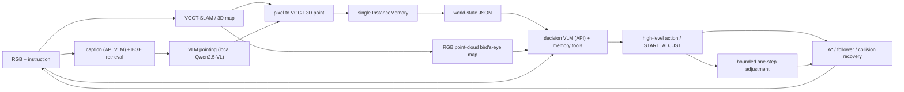

# VGGT-Nav Agent 当前架构

## 1. 设计目标

本系统是一个面向多目标具身导航的 VLM harness。确定性模块为 VLM 提供
可靠的视觉、3D 地图、实例记忆和运动执行能力；VLM 负责解释开放世界语义、
维护实例描述并做高层决策。

系统刻意不维护 `belief anchor / confirmed / rejected` 等先验语义状态，也不
建立永久黑名单。只要 VLM pointing 的像素能由 VGGT 恢复出有效 3D 点，它就
成为一个可导航 instance。类别与任务匹配关系由 VLM 根据证据持续判断。



## 2. 模块边界

| 模块 | 文件 | 职责 |
|---|---|---|
| SLAM 与语义服务 | `mapping/server.py` | VGGT 子图、caption 检索、pointing、像素到 3D、语义与图像诊断记录 |
| 关键帧策略 | `mapping/keyframes.py` | 组合光流阈值与最大观测间隔，保证弱纹理直行时仍定期刷新关键帧 |
| caption 语义记忆 | `mapping/caption_store.py` | 异步 caption worker、BGE-M3 向量索引与检索、落盘持久化 |
| VLM 网关 | `mapping/vllm_client.py` | OpenAI 兼容客户端：优先级队列、同帧缓存、重试；caption 与 pointing 各持一个实例 |
| 语义模型接口 | `mapping/pointing.py` | 历史候选图像上的 VLM pointing、JSON 校验、bbox 约束的 patch 深度采样 |
| 唯一实例记忆 | `agents/memory.py` | 3D 坐标、VLM 文本、证据引用、reported 标记 |
| 决策状态 | `agents/decision_state.py` | 将实例、frontier、任务进度和几何代价组织成 JSON |
| 决策 harness | `decision/agent_loop.py` | 工具循环、动作 schema、ID 校验与 trace |
| 决策提示词 | `decision/prompts.py` | 系统契约、事件说明和 world-state prompt 组装 |
| 高层状态机 | `agents/nav_agent.py` | 感知—记忆—决策—执行闭环及确定性降级 |
| 几何执行 | `agents/navigator.py` | 占据栅格、A*、路径跟随、碰撞恢复 |
| 探索 | `agents/skeleton.py` | 几何/语义统一 frontier、信息增益与骨架拓扑 |
| 路径排序 | `agents/planner.py` | VLM 不可用时的最近实例/TSP 回退 |
| 运维诊断 | `scripts/diagnostics/` | 重力、自由空间和点云的只读检查脚本 |
| 远端工具 | `scripts/remote/` | SSH 助手（`remote_ssh.py`）与远端离线验证脚本（caption/pointing/BGE 检索测试、鸟瞰图重渲）；脚本内使用远端绝对路径，本仓库不引用 |

## 3. 统一感知与实例生成

探索阶段的语义链路是：

1. 为关键帧生成查询无关的 caption（首行列可见物体类别，随后逐实例一句
   自然语言内在属性描述，跳过 wall/floor/ceiling），并用 BGE-M3 建立文本
   检索索引。caption 模型默认走独立 VLM API（`NAV_CAPTION_API_MODEL`，
   URL/Key 缺省回落决策 VLM 的 `NAV_VLM_API_*`）；未配置时回落本地 vLLM
   （`NAV_CAPTION_MODEL_PATH`）。pointing 始终走本地 vLLM
   （`NAV_POINTING_MODEL_PATH`，当前为 Qwen2.5-VL-7B-Instruct-AWQ）；
2. 根据任务文本召回相关关键帧，默认 top-K=2（`NAV_RETRIEVE_TOP_K` /
   `NAV_GROUND_TOP_K`）；
3. VLM 在召回图像上 pointing 一个或多个像素；point 被要求落在物体可见
   区域中心（该像素将用于采深度），bbox 仅作交叉验证——point 落在 bbox
   外时置信度减半；
4. 在 VGGT 点图中采样像素邻域：有 bbox 时采样窗被约束在 bbox 内区
   （四边内缩 15%），point 严重偏离时退化为 bbox 内区中心采样；patch 内
   先按 VGGT confidence 过滤再取中位数，恢复当前图优化坐标系中的 3D 点；
5. 每个有效 3D 结果立即写入 `InstanceMemory`；
6. 新实例入库后，VLM 结合 pointing overlay、bbox 局部裁剪图、任务文本
   与关键帧 caption 生成实例级初始描述（`chat_text` 自由文本调用）；
   VLM 不可用或失败时保留关键帧 caption 作为初始文本。

建图不把每个观测都作为关键帧。默认在相对上一关键帧的平均光流超过 40
像素时取帧；即使光流不足，也最多间隔 3 个观测强制刷新。每个子图包含
16 个新关键帧，并与下一子图共享 3 帧，以兼顾视图重叠、计算量和跨子图
配准稳定性。`frame_captions.jsonl` 会记录每帧的 `keyframe_reason`，服务状态
会报告强制关键帧数量，便于发现弱纹理或选帧异常。

环视（SCAN）结束后、检索刷新实例前，agent 会等待 caption worker 消化完
已入队关键帧（`caption_pending`，有界等待，超时继续），避免异步 caption
漏掉刚看到的场景。

探索阶段不先用 VQA 判定类别，也不以 pointing 分数、目标尺寸或深度方差
阻止实例入库。这些值只作为 evidence 保存。到达候选点后不再强制调用
`ground_frame` 或 pointing/verify；决策 VLM 直接接收当前 RGB、候选历史证据和
world-state，决定报告、离开、扫描或进入微调。（`ground_frame` /
`verify_frame` 链路仅保留为单帧诊断接口，不在生产路径上。）

### 3.1 几何覆盖、语义检查与统一 frontier

地图保留两个职责不同的 bool 层：

- `geometry_observed`：该格是否有可靠 VGGT 3D 覆盖，用于区分几何未知、
  障碍和占据分类不确定区域；旧字段 `observed` 是它的兼容别名；
- `semantic_inspected`：可通行格是否已有足够语义观察。只有已完成 caption
  的关键帧才贡献该层；一次近距离观察，或至少两个同时满足最小相机基线和
  方位角差的有效 3D 可见观察才标记完成。连续同向关键帧、caption pending
  和单次远距离弱观察仍属于待探索。

另有独立的 `traversed` 诊断层，只表示机器人真实执行轨迹。它不能增加
`free`、清除 `obstacle`、扩大 `geometry_observed`，也不参与 A* 或 frontier。
当前位置附近缺少地面证据时，系统保留冲突并报告，而不是沿历史轨迹补出
可通行走廊；点云栅格完全不可用时也拒绝回退为“面包屑地图”。

对决策层只暴露一套 frontier。几何 frontier 位于可达自由区与
`geometry_observed=false` 的边界；语义 frontier 位于已检查自由区与
`semantic_inspected=false` 自由区的边界；两者取并集后统一聚类、A* 可达性
过滤和冷却。每个候选仍带 `reason=geometry|semantic|both`、两类 gain、路径
代价和 utility，供 VLM 理解和确定性排序。语义服务未启用或协议不可用时会
明确记录状态，不会伪造语义覆盖。

默认阈值可由 `NAV_SEMANTIC_RANGE_M=4.0`、
`NAV_SEMANTIC_CLOSE_RANGE_M=2.0`、`NAV_SEMANTIC_MIN_VIEWS=2` 调整；
多视角判定还使用 `NAV_SEMANTIC_MIN_VIEW_ANGLE_DEG=25` 和
`NAV_SEMANTIC_MIN_VIEW_BASELINE_M=0.5`；
两类 gain 权重分别由 `NAV_FRONTIER_GEOMETRY_WEIGHT` 和
`NAV_FRONTIER_SEMANTIC_WEIGHT` 控制。

## 4. 单一 InstanceMemory

每个 `InstanceNode` 包含：

```text
id                 稳定的 episode 内编号
point              对齐地图坐标系中的 3D 点
text               VLM 可自由改写的实例工作记忆
evidence[]         frame、candidate、point score、bbox 等真实证据引用
reported           是否已经向 benchmark 报告
frame_id           最近关联关键帧
candidate_id       mapping server 的稳定候选 ID
step               最近更新时间
attach_node        可选骨架节点
```

记忆层只按稳定 `candidate_id` 更新同一条记录，不根据距离或类别自动合并。
跨视角重复由 VLM 显式调用 `merge_instances` 合并；合并后保留最小实例 ID，
位置取合并记录的中位数，证据取并集。任何未 `reported` 的实例都能作为
`GOTO_INSTANCE` 目标。

## 5. 决策 VLM 的输入

每次事件决策包含三类输入：

- world-state JSON：公开任务、进度、frontier 信息、近期事件、终止统计，
  以及实例表的有界摘要——未报告实例按"最近邻 + 最新 + 任务相关"并集取
  top-K（`NAV_STATE_MAX_INSTANCES`，默认 30），文本截断 120 字符；其余
  未报告实例折叠为 `instances_omitted_ids`（仍是合法导航目标），已报告
  实例折叠为 `reported_instance_ids`，全文与证据经 `search_instances` /
  `inspect_instance` 按需查询；A* 路径代价只对入选摘要的实例预计算；
- RGB 点云鸟瞰图：先将 VGGT-SLAM 点云重力对齐，再严格沿 Z 轴正投影到 XY
  平面；默认以 `NAV_DECISION_MAP_POINT_STRIDE=3` 提取点，只保留高度
  2.2m 以下的点以去除天花板遮挡，同一输出像素内的 RGB 按高度带通权重
  融合（地板层 1.0、家具层最高 3.0、接近 2.2m 上限渐隐；高度只影响颜色，
  不影响投影位置），最多保留 `NAV_DECISION_MAP_MAX_POINTS=2000000` 个点。
  底图不再用颜色编码 free、obstacle、geometry/semantic coverage 等区域，
  也不显示历史轨迹或原始 frontier 边界。蓝色箭头是 Agent 位置和朝向，
  紫色菱形 `fN` 是经过可达性与冷却过滤后可选择的 frontier，绿色圆圈 `tN`
  是实例目标，橙色星形是 active target。图中 ID 与 world-state 完全一致；
  occupancy 和语义覆盖仍由确定性模块用于 A*、frontier 生成和结束判断，
  只是不再作为 VLM 图像底色。点、颜色、位姿和 frontier 来自 mapping
  server 同一次锁内 frame snapshot，并按 frame/submap/loop revision 刷新；
  即将显示的实例按 candidate_id 批量重投影，避免回环后叠加到不同坐标系；
- 事件图像：普通决策与微调时的当前 RGB，到达时的候选历史证据，
  或一圈扫描的多视角图像。

所有距离与路径代价由确定性几何模块预计算，VLM 不输出坐标，也不估算地图
尺度。只有在 VLM 显式输出 `START_ADJUST` 后，它才可在有界微调状态中每轮
输出一个白名单离散动作。

## 6. VLM 记忆工具

决策 VLM 可在最终动作前调用：

| 工具 | 返回与副作用 |
|---|---|
| `search_captions(text)` | 返回 `[{frame_id, score, caption}]`，只读 |
| `search_instances(keywords, reported, top_k)` | 对VLM编写的实例text做不区分大小写的关键词OR匹配，按命中数排序，返回实例摘要，只读 |
| `look_instance(instance_id)` | 下一轮附加该实例的pointing证据图，缺失时回退关联关键帧；不存在时返回error，只读 |
| `inspect_instance(instance_id)` | 返回一个完整实例或 error，只读 |
| `update_instance(instance_id, text)` | 只覆盖 text，返回更新后的完整实例 |
| `merge_instances(instance_ids, text)` | 合并记录并返回保留的完整实例；最小 ID 保留、位置取中位数、证据并集、reported 取 OR；合并前快照全部参与记录，可撤销 |
| `undo_merge()` | 撤销最近一次 merge，恢复 keeper 合并前状态并重建被删除实例；合并后已发生的报告不撤销 |

工具不能伪造或直接改写 3D 坐标、路径代价和 `reported` 状态。写工具
（`update_instance` / `merge_instances`）成功执行后，harness 会重新生成
world-state 并随工具结果一并下发，本轮后续的动作校验也基于刷新后的状态，
避免选择已被合并删除或状态改变的实例。

推荐链路为 `search_instances → inspect_instance / look_instance →
update_instance / merge_instances → 最终动作`。当现有实例不足时，可先用
`search_captions` 检索历史图像描述，再据此选择实例、frontier、环视或探索。

动作的系统效果：`GOTO_INSTANCE` 解析实例 3D 点并执行 A* 导航；
`GOTO_FRONTIER` 沿预计算路径扩展地图；`REPORT_FOUND` 由决策 VLM 直接授权并发送
benchmark 报告；`SCAN` 环视 12 个转向步、保存四向图像、刷新实例后重新
决策；`START_ADJUST` 显式进入微调；`END_ADJUST` 退出并恢复进入前的决策事件；
`EXPLORE` 离开当前目标但保留记忆，并自动选择最高 utility 的可达、非冷却
frontier 执行 A* 跟随，而不是随机游走；`FINISH` 不可逆结束。

## 7. VLM 最终输出

VLM 必须输出一个 JSON 对象：

```json
{
  "action": "GOTO_INSTANCE | GOTO_FRONTIER | REPORT_FOUND | SCAN | EXPLORE | FINISH | START_ADJUST | END_ADJUST | MOVE_FORWARD | TURN_LEFT | TURN_RIGHT",
  "target_id": "instance/frontier id，其他动作使用 null",
  "reason": "简短推理摘要，仅用于日志"
}
```

事件允许的动作：

| 事件 | 允许动作 |
|---|---|
| `world_state_updated` | `GOTO_INSTANCE`、`GOTO_FRONTIER`、`EXPLORE`、`START_ADJUST` |
| `arrival` | `REPORT_FOUND`、`SCAN`、`EXPLORE`、`GOTO_INSTANCE`、`GOTO_FRONTIER`、`START_ADJUST` |
| `scan_complete` | `GOTO_INSTANCE`、`GOTO_FRONTIER`、`EXPLORE`、`START_ADJUST` |
| `finish_check` | `GOTO_INSTANCE`、`GOTO_FRONTIER`、`EXPLORE`、`FINISH` |
| `adjustment` | `MOVE_FORWARD`、`TURN_LEFT`、`TURN_RIGHT`、`END_ADJUST` |

程序只做结构性约束：动作属于当前事件、目标 ID 存在、导航实例尚未报告。
任务明确要求数量（`many`）且报告数不足时，`FINISH` 会被降级；其余语义与
探索终止判断交给 VLM。

## 8. 执行闭环

`GOTO_INSTANCE` 解析为实例 3D 点，经占据栅格和 A* 生成路径，由
`PathFollower` 输出离散运动。回环优化后，实例可通过 `candidate_id` 重投影
刷新坐标。碰撞、路径丢失和 frontier 失败计数仅用于执行恢复，不表达语义
否定。

到达实例后：

1. 决策 VLM 直接查看当前 RGB、选中候选的历史证据和 `arrival` 状态；
2. 证据充分时可直接 `REPORT_FOUND`，候选不符时可离开或选择其他实例/frontier；
3. 需要改变位置或视角时由 VLM 自主输出 `START_ADJUST`，到达本身不会强制进入；
   没有 active target 时也允许用它做短距离主动探索，例如转向观察未知区域或
   前进一步取得更好视野，但长距离探索仍交给 `EXPLORE` / `GOTO_FRONTIER`；
4. adjustment 的每轮输入都重新编码最新 RGB，并附带以当前位置为中心的局部
   鸟瞰图（默认半径 4m，可用 `NAV_ADJUST_MAP_RADIUS_M` 调整）、active target、
   上一动作和基于 RGB 运动差的碰撞结果；局部图固定排在当前 RGB 后，避免被
   多视角证据挤出 VLM 图片上限；
5. adjustment 中每个新 RGB 只允许一个 `MOVE_FORWARD` / `TURN_LEFT` /
   `TURN_RIGHT`，执行后重新观察；默认最多 10 步（`NAV_ADJUST_MAX_STEPS`）；
6. VLM 输出 `END_ADJUST` 后退出微调，系统立即恢复进入前的决策事件；
   若微调来自全局探索事件，恢复前会用新观测重建 frontier 状态；
   同一 observation 内重复的 `START_ADJUST` 会被安全抑制，并先执行一个原子动作，
   等待下一帧 RGB 后再允许重新进入微调，避免决策递归循环；
7. `SCAN` 是通用环视而非强制目标复核：环视结束后刷新 caption、pointing、
   实例和 frontier，原实例不会被自动否定或拉黑。

## 9. 诊断与可复盘输出

所有内置默认输出统一放在 `debug_output/<run-id>/`。通过
`NAV_DEBUG_ROOT` 修改总根目录，通过 `NAV_RUN_ID` 隔离一次实验；同一次实验的
服务和 benchmark 应共享这两个变量。目录按职责分为 `agent/`、`mapping/`、
`benchmark/` 和 `diagnostics/`。旧的组件级变量仍兼容，但相对路径会被解析到
当前 run 目录，避免在启动工作目录中散落文件。

每个评测 episode 可产生以下记录，所有关联通过 `episode`、`step` 和
`frame_id` 完成，不保存 API key；图像 base64 默认不落盘，仅在显式打开
trace 开关时内联：

| 产物 | 内容 |
|---|---|
| `action_trace.jsonl` | 每步实际 Habitat 动作、agent mode、当前目标、碰撞状态、mapping frame 及最近决策 |
| `decision_trace.jsonl` | 事件、校验后高层动作、理由、工具调用与校验结果 |
| `vlm_calls.jsonl` | 决策/实例描述 VLM 的 prompt、图像标签与哈希、原始 API 响应及解析结果；`NAV_VLM_TRACE_INLINE_IMAGES=1` 时内联图像 base64 |
| `vlm_caption.jsonl` / `vlm_pointing.jsonl` | mapping 端 caption/pointing VLM 按角色拆分的完整调用记录（prompt + 输出）；`NAV_VLLM_TRACE_IMAGES=1` 时内联图像 base64 |
| `<episode>_frames/` | mapping server 收到的全部 RGB，文件名中包含 `frame_id` |
| `<episode>_frame_captions.jsonl` | 全部图像的 `frame_saved` 记录和关键帧的 `caption_result`；非关键帧不做 caption |
| `<episode>_queries.jsonl` | caption 检索、ground_object 与 3D 候选诊断摘要（VLM 原始输出已拆到上面的角色文件） |
| `vlm_inputs/` | 实际进入决策 API payload 的 RGB、鸟瞰图和候选证据；与 `vlm_calls.jsonl` 中 SHA-1 一致 |

`scripts/diagnostics/dump_mapping_snapshot.py` 可将一次 VGGT frame snapshot 保存为
无 pickle 的 NPZ；`render_occupancy_snapshot.py` 可在不重跑 Habitat 或 VGGT-SLAM
的情况下反复重建 occupancy、渲染鸟瞰图并统计 traversed/unknown 与
traversed/obstacle 冲突；`replay_rgb_sequence.py` 用固定 RGB 比较关键帧和 SLAM
参数，只有显式 `--reset-map` 才会清空测试专用 mapping server。

## 10. 确定性降级

决策 VLM 不可用或连续输出非法结构时，系统才使用简单回退：优先最近的未
报告实例，否则选择最高 utility 的统一可达 frontier，再否则执行基础探索。
frontier utility 由加权几何/语义信息增益、路径代价和执行失败次数构成，不含
目标类别 belief。

## 11. 当前边界

- 实例初始文本已在入库时由 VLM 生成实例级描述（overlay + bbox 局部图 +
  任务上下文），其质量与耗时需要在真实模型上验证；
- pointing 精度受本地 7B VLM（Qwen2.5-VL-AWQ）能力限制，小目标/远目标的
  像素误差目前由 bbox 约束采样兜底；如需更高精度可换专门 pointing 模型
  （如 Molmo），接口上只需替换 `NAV_POINTING_MODEL_PATH` 与 prompt；
- 跨视角实例关联完全交给决策 VLM；world-state 实例表已做有界摘要，
  长 episode 下若 top-K 选择仍分散注意力，可再引入空间查询或自动候选
  对提示，但不应重新引入硬语义状态；
- `REPORT_FOUND` 由决策 VLM 直接授权，因此当前主要风险是图像语义正确但报告
  位置未满足 benchmark 近距离阈值，以及对相似外观的过度确信；
- adjustment 由 VLM 自主触发；如果它在视角或距离不足时仍直接报告，不会自动
  强制微调，需通过决策提示与评测 trace 继续校准；
- 完整效果需要在真实模型、VGGT-SLAM 服务和 benchmark episode 上做闭环评测。
