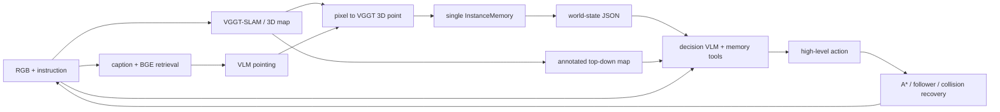

# VGGT-Nav Agent 当前架构

## 1. 设计目标

本系统是一个面向多目标具身导航的 VLM harness。确定性模块为 VLM 提供
可靠的视觉、3D 地图、实例记忆和运动执行能力；VLM 负责解释开放世界语义、
维护实例描述并做高层决策。

系统刻意不维护 `belief anchor / confirmed / rejected` 等先验语义状态，也不
建立永久黑名单。只要 VLM pointing 的像素能由 VGGT 恢复出有效 3D 点，它就
成为一个可导航 instance。类别与任务匹配关系由 VLM 根据证据持续判断。



## 2. 模块边界

| 模块 | 文件 | 职责 |
|---|---|---|
| SLAM 与语义服务 | `mapping/server.py` | VGGT 地图、caption 检索、pointing、像素到 3D、到达复核 |
| 语义模型接口 | `mapping/pointing.py` | VLM pointing；到达阶段的查询条件化 VQA |
| 唯一实例记忆 | `agents/memory.py` | 3D 坐标、VLM 文本、证据引用、reported 标记 |
| 决策状态 | `agents/decision_state.py` | 将实例、frontier、任务进度和几何代价组织成 JSON |
| 决策 harness | `decision/agent_loop.py` | prompt、工具循环、动作 schema 与 ID 校验 |
| 高层状态机 | `agents/nav_agent.py` | 感知—记忆—决策—执行闭环及确定性降级 |
| 几何执行 | `agents/navigator.py` | 占据栅格、A*、路径跟随、碰撞恢复 |
| 探索 | `agents/skeleton.py` | 纯几何 frontier 与骨架拓扑 |
| 路径排序 | `agents/planner.py` | VLM 不可用时的最近实例/TSP 回退 |

## 3. 统一感知与实例生成

探索阶段的语义链路是：

1. 为关键帧生成 caption，并用 BGE 建立文本检索索引；
2. 根据任务文本召回相关关键帧；
3. VLM 在召回图像上 pointing 一个或多个像素；
4. 在 VGGT 点图中采样像素邻域，恢复当前图优化坐标系中的 3D 点；
5. 每个有效 3D 结果立即写入 `InstanceMemory`；
6. 新实例入库后，VLM 结合 pointing overlay、bbox 局部裁剪图、任务文本
   与关键帧 caption 生成实例级初始描述（`chat_text` 自由文本调用）；
   VLM 不可用或失败时保留关键帧 caption 作为初始文本。

环视（SCAN）结束后、检索刷新实例前，agent 会等待 caption worker 消化完
已入队关键帧（`caption_pending`，有界等待，超时继续），避免异步 caption
漏掉刚看到的场景。

探索阶段不先用 VQA 判定类别，也不以 pointing 分数、目标尺寸或深度方差
阻止实例入库。这些值只作为 evidence 保存。到达目标位置后，系统才用当前
RGB 调用 `ground_frame`，为 VLM 提供近距离证据。

## 4. 单一 InstanceMemory

每个 `InstanceNode` 包含：

```text
id                 稳定的 episode 内编号
point              对齐地图坐标系中的 3D 点
text               VLM 可自由改写的实例工作记忆
evidence[]         frame、candidate、point score、bbox 等真实证据引用
reported           是否已经向 benchmark 报告
frame_id           最近关联关键帧
candidate_id       mapping server 的稳定候选 ID
step               最近更新时间
attach_node        可选骨架节点
```

记忆层只按稳定 `candidate_id` 更新同一条记录，不根据距离或类别自动合并。
跨视角重复由 VLM 显式调用 `merge_instances` 合并；合并后保留最小实例 ID，
位置取合并记录的中位数，证据取并集。任何未 `reported` 的实例都能作为
`GOTO_INSTANCE` 目标。

## 5. 决策 VLM 的输入

每次事件决策包含三类输入：

- world-state JSON：公开任务、进度、frontier 信息、近期事件、终止统计，
  以及实例表的有界摘要——未报告实例按"最近邻 + 最新 + 任务相关"并集取
  top-K（`NAV_STATE_MAX_INSTANCES`，默认 30），文本截断 120 字符；其余
  未报告实例折叠为 `instances_omitted_ids`（仍是合法导航目标），已报告
  实例折叠为 `reported_instance_ids`，全文与证据经 `search_instances` /
  `inspect_instance` 按需查询；A* 路径代价只对入选摘要的实例预计算；
- 标注俯视图：占据栅格、轨迹、机器人姿态、实例编号与 frontier 编号；
- 事件图像：到达时的当前 RGB、候选历史证据，或一圈扫描的多视角图像。

所有距离与路径代价由确定性几何模块预计算，VLM 不输出坐标，也不估算地图
尺度。

## 6. VLM 记忆工具

决策 VLM 可在最终动作前调用：

| 工具 | 返回与副作用 |
|---|---|
| `search_captions(text)` | 返回 `[{frame_id, score, caption}]`，只读 |
| `search_instances(keywords, reported, top_k)` | 对VLM编写的实例text做不区分大小写的关键词OR匹配，按命中数排序，返回实例摘要，只读 |
| `look_instance(instance_id)` | 下一轮附加该实例的pointing证据图，缺失时回退关联关键帧；不存在时返回error，只读 |
| `inspect_instance(instance_id)` | 返回一个完整实例或 error，只读 |
| `update_instance(instance_id, text)` | 只覆盖 text，返回更新后的完整实例 |
| `merge_instances(instance_ids, text)` | 合并记录并返回保留的完整实例；最小 ID 保留、位置取中位数、证据并集、reported 取 OR；合并前快照全部参与记录，可撤销 |
| `undo_merge()` | 撤销最近一次 merge，恢复 keeper 合并前状态并重建被删除实例；合并后已发生的报告不撤销 |

工具不能伪造或直接改写 3D 坐标、路径代价和 `reported` 状态。写工具
（`update_instance` / `merge_instances`）成功执行后，harness 会重新生成
world-state 并随工具结果一并下发，本轮后续的动作校验也基于刷新后的状态，
避免选择已被合并删除或状态改变的实例。

推荐链路为 `search_instances → inspect_instance / look_instance →
update_instance / merge_instances → 最终动作`。当现有实例不足时，可先用
`search_captions` 检索历史图像描述，再据此选择实例、frontier、环视或探索。

动作的系统效果：`GOTO_INSTANCE` 解析实例 3D 点并执行 A* 导航；
`GOTO_FRONTIER` 沿预计算路径扩展地图；`REPORT_FOUND` 先进入视觉伺服，
成功后才发送 benchmark 报告；`SCAN` 环视12个转向步、保存四向图像、刷新
实例后重新决策；`EXPLORE` 离开当前目标但保留记忆；`FINISH` 不可逆结束。

## 7. VLM 最终输出

VLM 必须输出一个 JSON 对象：

```json
{
  "action": "GOTO_INSTANCE | GOTO_FRONTIER | REPORT_FOUND | SCAN | EXPLORE | FINISH",
  "target_id": "instance/frontier id，其他动作使用 null",
  "reason": "简短推理摘要，仅用于日志"
}
```

事件允许的动作：

| 事件 | 允许动作 |
|---|---|
| `world_state_updated` | `GOTO_INSTANCE`、`GOTO_FRONTIER`、`EXPLORE` |
| `arrival` | `REPORT_FOUND`、`SCAN`、`EXPLORE` |
| `scan_complete` | `GOTO_INSTANCE`、`GOTO_FRONTIER`、`EXPLORE` |
| `finish_check` | `GOTO_INSTANCE`、`GOTO_FRONTIER`、`EXPLORE`、`FINISH` |

程序只做结构性约束：动作属于当前事件、目标 ID 存在、导航实例尚未报告。
任务明确要求数量（`many`）且报告数不足时，`FINISH` 会被降级；其余语义与
探索终止判断交给 VLM。

## 8. 执行闭环

`GOTO_INSTANCE` 解析为实例 3D 点，经占据栅格和 A* 生成路径，由
`PathFollower` 输出离散运动。回环优化后，实例可通过 `candidate_id` 重投影
刷新坐标。碰撞、路径丢失和 frontier 失败计数仅用于执行恢复，不表达语义
否定。

到达实例后：

1. `ground_frame` 在当前 RGB 上产生近距离语义与 pointing 证据；
2. VLM 选择报告、通用环视或暂时离开；
3. `SCAN` 不再绑定当前实例：它原地环视、补充地图并保存四个方向的图像；
4. 环视结束后重新执行任务相关的 caption 检索、pointing 和实例入库，随后
   从全部实例与 frontier 中重新选择下一步；原实例不会被否定或拉黑；
5. 报告前视觉伺服负责居中和逼近；伺服超时转入通用环视，不能凭坐标直接报告。

## 9. 确定性降级

决策 VLM 不可用或连续输出非法结构时，系统才使用简单回退：优先最近的未
报告实例，否则选择最高纯几何 utility 的可达 frontier，再否则执行基础探索。
frontier utility 只由信息增益、路径代价和执行失败次数构成，不含语义 belief。

## 10. 当前边界

- 实例初始文本已在入库时由 VLM 生成实例级描述（overlay + bbox 局部图 +
  任务上下文），其质量与耗时需要在真实模型上验证；
- 跨视角实例关联完全交给决策 VLM；world-state 实例表已做有界摘要，
  长 episode 下若 top-K 选择仍分散注意力，可再引入空间查询或自动候选
  对提示，但不应重新引入硬语义状态；
- `REPORT_FOUND` 仍经过视觉伺服，实际 benchmark 环境需要继续标定停止距离、
  视野丢失恢复和碰撞行为；
- 完整效果需要在真实模型、VGGT-SLAM 服务和 benchmark episode 上做闭环评测。
