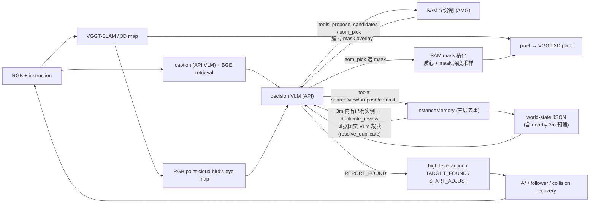

# VGGT-Nav Agent 架构文档

## 1. 概述：harness 设计思想

本系统是一个面向多目标具身导航的 VLM harness，仿照 coding agent 的组织
方式：**VLM 只做高层认知（规划、检索、核实、裁决），确定性模块充当它的
感知、记忆与执行工具**。语义链路（caption 检索 → 看图 → SAM 全分割选
目标 → 实例化 → 导航 → 报告）的每一步都是 VLM 可独立调用的工具，没有
任何一步会自动把未经核验的感知结果写入导航记忆。

两条贯穿全局的原则：

- **感知与记忆写入分离（候选事务）**：扫描、caption、SAM 分割的产出先
  进入不可导航的候选池，经 VLM 显式三值审核（ACCEPT/REJECT/UNCERTAIN）
  后才成为可导航实例；
- **VLM 不碰几何**：所有距离、路径代价、可达性由确定性模块预计算后以
  world-state JSON 下发；VLM 不输出世界坐标（实例化像素除外），不估计
  地图尺度。

系统不维护 `belief anchor / confirmed / rejected` 等先验语义状态，也不
建立永久黑名单。凡是能由 VGGT 点云恢复出有效 3D 点的像素都可以成为
可导航 instance；类别与任务匹配关系由 VLM 根据证据持续判断。

在与 benchmark 的关系上，本系统承担双重角色：**参考实现**（用强组件
搭建的 baseline，证明任务可解且不饱和）与**诊断仪器**（决策、工具、
审核、尺度全程留痕，为 benchmark 的有效性提供实证证据——见第 2 节
第 8 条与 BENCHMARK_DESIGN.md 3.6）。

### 1.1 为什么用 harness 应对这类任务

MOS/MOC 任务的要求恰好落在"端到端 VLM"与"纯启发式管线"都不覆盖的
中间地带，harness 是针对这一错位的架构选择：

- **长时程 vs 上下文与成本**：一个 episode 长达数百步。端到端 VLM
  逐步决策不仅调用成本不可承受，更关键的是视觉上下文随步数爆炸，
  早期观察必然被挤出窗口。harness 把低层控制交给确定性执行器
  （GOTO 执行到底、事件点才交还），决策密度降到每 300 步 12–20 次，
  VLM 的注意力只花在真正的决策点上。
- **记忆是 harness 的结构性强项，而 VLM 单靠上下文做不到**：MOS/MOC
  要求可靠维护"找到过哪些、是否重复、哪里还没探索"——这正是 benchmark
  的核心考点之一。harness 把这些状态外化为显式数据结构：三层去重记忆
  保证实例身份与报告幂等，world-state 每步重建任务账本与最近动作，
  notes 与分页动作历史让 VLM 自己维护长期工作记忆。全程 completion
  模式、不依赖 server 端对话状态：记忆的正确性、持久性和可审计性由
  确定性代码保证，VLM 只负责基于记忆做判断；相比之下，端到端 VLM 在
  长上下文中自行记账既不可靠，也无法审计和复现。
- **几何与数值必须精确**：尺度、路径代价、可达性、3m 去重半径都是
  连续数值，VLM 的数值估计不可靠。harness 预计算全部几何量以下发，
  VLM 不输出世界坐标、不估算尺度。
- **目标选择、属性判别、终止判断是 VLM 的强项，且无法用规则替代**：
  "这堆候选里哪个最可能是目标""这个区域探索充分了吗、能不能停"
  依赖语义常识与不确定推理，启发式写不出通用规则。harness 恰好只把
  这些决策留给 VLM。
- **纯度论证**：harness 把未被测评的低层能力（避障、路径跟随）尽量
  确定性化，使 benchmark 分数更纯粹地反映被测能力（规划、记忆、
  终止判断），减少"其实是败在导航"这类混淆。这也是它能充当
  benchmark 诊断仪器的前提——测量仪器自身的无关失败源越少，
  读数越可信。

换言之，harness 不是工程上的权宜之计，而是与 benchmark 测评目标
同构的设计：benchmark 测什么，harness 就把什么暴露为 VLM 的显式
决策点；benchmark 不测什么，harness 就把什么自动化掉；而记忆这一
被测能力的载体，由 harness 托管为可靠的基础设施，使"记没记住"
与"会不会用记忆决策"可以被分开测量。

## 2. 论文视角的核心贡献点

以下是将本系统与"VGGT-SLAM + LLM 直接规划"式朴素组合区分开的设计，
按对最终指标的影响排序，均可作为论文方法与消融的候选：

1. **SoM 候选事务感知链路**：把像素级目标定位从"生成坐标"降级为
   "选择题"。SAM automatic mask generation 产出编号 mask overlay，VLM
   只做 mask 选择与三值审核，审核通过的 mask 才参与深度采样与 3D 实例化。
   这绕开了 pointing 模型/VLM 像素坐标输出不可靠的瓶颈（实测像素落点
   稳定偏移是早期最大失败源），并把每次实例化的成本集中在近处当前帧。
2. **三层去重记忆**：Observation（采集幂等）/ Canonical Instance
   （物理实体）/ ReportClaim（报告幂等）。实例化时（而非报告时）按 3m
   空间预筛挂起疑似重复，证据图交 VLM 裁决；报告层保证一个物理实例
   最多一条 claim，从机制上杜绝 many/all 模式的重复报告 FP。
3. **在线度量尺度恢复**：单目 VGGT-SLAM 只有 Sim(3) 相对尺度。系统以
   多帧地面—相机高度（1.5m）尺规为唯一导航尺度来源（候选三连稳定后
   锁定，±12% 噪声带内不更新），动作步长回归（0.25m/步）退为纯诊断
   信号。尺度错误会级联污染占据栅格、
   到达半径与去重半径，该模块是导航可靠性的前提。
4. **射线法自由空间**：VGGT 点云因漂移/回环产生垂直鬼影层，单一全局
   地板高度会漏掉大部分地板。按帧从相机向观测点发射线，躯干高度带内
   经过的格子标 free，被多条射线穿过的障碍格判为鬼影清除。
5. **几何 + 语义统一 frontier**：`geometry_observed` 与
   `semantic_inspected` 双 bool 层分别刻画"有没有 3D 覆盖"与"有没有
   被充分看过"，两类 frontier 并集后统一聚类、A* 可达性过滤与冷却，
   使探索同时被"没建图"和"没看懂"驱动。
6. **caption 命中中断**：导航执行不再定期咨询 VLM（执行到底），唯一
   中途打断是确定性信号——新关键帧 caption 与目标短语的 BGE 相关度
   超阈值即打断当前路径立即决策，把"路过即发现"变成显式机制。
7. **记忆外包的决策上下文**：world-state JSON（任务账本、frontier 表、
   实例表有界摘要、最近 3 步动作）+ VLM 自维护 notes（≤500 字符）+
   分页动作历史工具，全程 completion 模式、不依赖 server 端对话状态。
8. **诊断透明性**：决策事件、工具调用、候选审核、尺度锁定与实例池
   全程留痕（`decision_trace.jsonl` / `vlm_calls.jsonl` /
   `get_target_pool()`）。这使 agent 同时成为 benchmark 的诊断仪器：
   U_t 时间序列、frontier 选择非贪心率、预算压力行为漂移、工具调用链
   深度等"选择存在性"证据均可从 trace 离线算出，用于实证检验
   benchmark 是否真的在搜索、选择、判别、终止各环节制造了决策空间
   （指标定义见 BENCHMARK_DESIGN.md 3.6）；诊断层各指标对应的失败模式
   （重复报告、提前终止、池覆盖不足等）也都在本系统的实测中被真实
   观测到，形成指标设计的存在性证明。

## 3. 系统架构总览



| 模块 | 文件 | 职责 |
|---|---|---|
| SLAM 与语义服务 | `mapping/server.py` | VGGT 子图、caption 检索、pointing、像素到 3D、语义与图像诊断记录 |
| 关键帧策略 | `mapping/keyframes.py` | 组合光流阈值与最大观测间隔，保证弱纹理直行时仍定期刷新关键帧 |
| caption 语义记忆 | `mapping/caption_store.py` | 异步 caption worker、BGE-M3 向量索引与检索、落盘持久化 |
| VLM 网关 | `mapping/vllm_client.py` | OpenAI 兼容客户端：优先级队列、同帧缓存、重试；caption 网关 |
| 语义模型接口 | `mapping/pointing.py` | pointing 双后端（qwen JSON / molmo XML 标签，已停用，仅保留 point_pixels RPC 兼容）、patch 深度采样 |
| SAM 后端 | `mapping/sam_backend.py` | 点提示精化 + AMG 全分割（SoM），server 端惰性加载 |
| 尺度标定 | `mapping/scale_calibration.py` | 动作步长回归的尺度诊断信号（不播种导航尺度） |
| 三层语义记忆 | `agents/memory.py` | 追加式 Observation、Canonical Instance、一次性 ReportClaim |
| 决策状态 | `agents/decision_state.py` | 将实例、frontier、任务进度和几何代价组织成 JSON |
| 决策 harness | `decision/agent_loop.py` | 工具循环（默认最多 15 轮）、动作 schema、ID 校验与 trace |
| 决策提示词 | `decision/prompts.py` | 系统契约、事件说明和 world-state prompt 组装 |
| 高层状态机 | `agents/nav_agent.py` | 感知—记忆—决策—执行闭环及确定性降级 |
| 几何执行 | `agents/navigator.py` | 占据栅格（射线法自由空间）、A*、路径跟随、碰撞恢复 |
| 探索 | `agents/skeleton.py` | 几何/语义统一 frontier、信息增益与骨架拓扑 |
| 路径排序 | `agents/planner.py` | VLM 不可用时的最近实例/TSP 回退 |
| 运维诊断 | `scripts/diagnostics/` | 重力、自由空间和点云的只读检查脚本 |
| 远端工具 | `scripts/remote/` | SSH 助手（`remote_ssh.py`）、跑批脚本与远端离线验证脚本 |

## 4. 建图与几何

### 4.1 关键帧与子图

建图不把每个观测都作为关键帧。默认在相对上一关键帧的平均光流超过 40
像素时取帧；即使光流不足，也最多间隔 3 个观测强制刷新。每个子图包含
16 个新关键帧，并与下一子图共享 3 帧。

工具返回前会等待 caption worker 消化完已入队关键帧（`caption_pending`，
有界等待，超时继续），避免异步 caption 漏掉刚看到的场景。

### 4.2 射线法自由空间与双层覆盖

地图保留两个职责不同的 bool 层：

- `geometry_observed`：该格是否有可靠 VGGT 3D 覆盖；
- `semantic_inspected`：可通行格是否已有足够语义观察（已完成 caption 的
  关键帧，一次近距离观察，或至少两个满足最小基线和方位角差的观察）。

`traversed` 诊断层只表示机器人真实执行轨迹，不参与 A* 或 frontier。

自由空间由**射线法**生成：VGGT 点云因漂移/回环会产生垂直鬼影层，单一
全局地板高度会漏掉大部分地板。当前实现为每帧相机对观测点子采样 400 条
射线，躯干高度带（地板上 0.25–1.6m）内经过的格子标为 free；被 ≥5 条
射线穿过的障碍格判定为鬼影并清除。地板高度按分块局部估计（全局峰锚
±0.35m 窗口内取局部中位数），障碍孤立点需票数 ≥2 或有邻居才保留。

对决策层只暴露一套 frontier：几何 frontier 与语义 frontier 取并集后统一
聚类、A* 可达性过滤和冷却。每个候选带 `reason`、两类 gain、路径代价和
utility。

### 4.3 在线度量尺度

所有米制消费者使用同一版本化 `MetricTransformSnapshot`。尺度只来自多帧
地面到已知相机高度（1.5m）的尺规；动作回归（`ScaleCalibrator`，利用
MOVE_FORWARD=0.25m 的已知步长，在滑动窗口内取比率中位数并以 MAD
剔除异常）仅保留为诊断信号，不播种也不切换导航尺度。
相机高度候选连续三次稳定后锁定，锁定范围内的 ±12% 地面噪声不更新尺度；
超过范围的稳定变化才提升 revision。每次规划先用地面尺规估计，再用锁定
尺度二次构建 occupancy，使地板带、体素、障碍膨胀、路径代价、冷却半径和
target pool 使用同一尺度。revision 切换会废弃 follower、临时障碍和
frontier 路径，并从同一服务端 frame snapshot 重规划；目标导航不得混用
独立 pose RPC 与点云 RPC。

## 5. 语义感知链路（全部由 VLM 按需驱动）

系统采用候选事务而非自动 ground 入库。首选工具链是
`propose_candidates → som_pick → commit_candidates`：SAM 全分割选中的
mask（质心为像素）先作为不可导航 proposal，Decision VLM 批量给出三值
审核，只有 ACCEPT 才批量解析为 active instance。扫描和 caption 刷新绝不
直接入库。

1. **caption**：每个关键帧由 API VLM（`NAV_CAPTION_API_MODEL`，当前为
   qwen3.8-flash + `enable_thinking=false`，`NAV_CAPTION_WORKERS=4` 并发）
   生成查询无关描述——首行 `Scene context:` 单独记录可能的房间类型与固定
   设施，次行 `Objects:` 列类别（每类一次），随后逐实例一句自然语言内在
   属性描述（实例描述不含位置/空间关系，跳过 wall/floor/ceiling，
   window/curtain 保留），BGE-M3 建立文本检索索引；
2. **search_frames(query, top_k)**：BGE 检索相关关键帧，返回
   `[{frame_id, score, caption}]`；
3. **view_frame(frame_id)**：把关键帧原始 RGB 附到 VLM 下一轮输入，
   VLM 亲眼核实；
4. **propose_candidates(frame_id, query)**：对整帧做 SAM automatic mask
   generation（`som_segment` RPC），返回编号 mask 表（0-1000 归一化
   centroid/bbox/area_frac）+ 编号 overlay 图，不注册任何实例。已在
   `_rejected_spots` 中的质心会被硬过滤（全被滤时返回
   `all_spots_rejected`，提示 VLM 走近再试）。要求 VLM 在**近处、当前
   帧**调用——远距小目标面积占比低于 0.2% 门槛不会被分割出来；
5. **som_pick(frame_id, mask_ids, query)**：把选中 mask 注册为不可导航
   proposal（质心为候选像素、mask 参与深度采样），随后走批量
   `commit_candidates` 三值审核。只有 `ACCEPT` 允许实例化；后两者记录为
   `semantic_rejections`，绝不入实例记忆；
6. **commit_candidates(reviews, label)**：对已审核子集批量给出
   `ACCEPT/REJECT/UNCERTAIN`，只解析 ACCEPT 写入 active instance（3m 内
   有邻居的挂起 `duplicate_review`）；
7. **instantiate_points(frame_id, pixels_1000, label)**（兜底）：把
   0-1000 归一化像素坐标变成可导航 3D 实例。`pixels_1000` 只应来自
   VLM 看过帧图像后自己给出的坐标（主链路已不用 pointing 模型）。先生成
   标记证据面板，再由显式 `ACCEPT` 作为 2D 语义硬门；随后才进行 VGGT
   confidence 过滤、patch 深度采样和 3D 坐标恢复。深度无效的候选进入
   `geometry_rejections`；通过两阶段后形成 Observation 并尝试实例化；
8. **review_crosshair(frame_id, pixel_1000, verdict, reason)**：旧的单点
   兼容接口（同 5 的三值审核语义），新代码优先使用批量
   `commit_candidates`。

### 5.1 SAM mask 精化与 SoM 全分割

`mapping/sam_backend.py`（server 端，惰性加载 `segment_anything`，
`NAV_SAM_CKPT`/`NAV_SAM_MODEL_TYPE`/`NAV_SAM_DEVICE`/`NAV_SAM_ENABLED`
配置；未安装或权重缺失时自动禁用并退回旧行为）：

- **点提示精化**：`point_pixels`/`prepare_pixels`/`instantiate_pixels`/
  `point_frame` 拿到的每个粗落点先经 SAM 点提示分割，用 mask 质心替换
  原始像素、mask bbox 作为证据裁剪框；深度采样优先在 mask 区域内取
  中位数（`sample_point_depth(mask_hw=...)`），不再受 patch 边缘背景
  污染。候选注册的 mask 也随之从合成圆盘升级为真实实例 mask，
  `resolve_candidate` 重采样时复用。
- **SoM 全分割（感知主链路）**：`propose_candidates` 对整帧调用 SAM
  automatic mask generator（`points_per_side=32`、
  `pred_iou_thresh=0.86`、`stability_score_thresh=0.92`、
  `min_mask_region_area=100`），过滤面积 <0.2%（≈614px @640×480）的
  碎片与 >55% 的背景区域，上限 `max_masks=24`；渲染编号 overlay 返回
  给决策 VLM，VLM 用 `som_pick` 把选中 mask 注册为 proposal（质心为
  候选像素、mask 参与深度采样），后续走证据面板 + `commit_candidates`
  流程。mask 在服务端按帧缓存（LRU 8 帧）。由此把"生成坐标"降级为
  "选择题"：决策 VLM 不再依赖 pointing 模型的点指精度，只在近处帧上做
  mask 选择。代价是**必须走近目标再 propose**——远距小目标过不了 AMG
  的面积/网格门槛。

## 6. 记忆系统：三层去重

### 6.1 Observation：采集幂等层

每次有效 2D→3D 结果产生一条追加式 Observation，保存 `observation_id`、
3D 点、frame/candidate、像素、bbox、置信度和原始文本。`candidate_id` 只是
mapping 证据句柄，不被当作跨视角物体身份。同一 candidate 的重放，或同帧
近像素/高 bbox IoU 的重复调用，只补充证据索引，不产生第二条 Observation。
Observation 的身份与原始证据不变；SLAM 回环后只允许通过 candidate 句柄
刷新其 3D 点。

### 6.2 Canonical Instance：物理实体层

`InstanceNode` 是供导航和决策引用的稳定实体，包含 `id`、`text`、
`observation_ids`、证据集合、当前导航点和 `report_claim_id`。实例导航点
取关联 Observation 中质量最高的真实 3D 点，不对不同视角点做坐标平均；
回环后仍可由 candidate 重投影刷新。关联结果采用三态生命周期：
`proposal → active canonical instance → reported instance`。

### 6.3 实例化时去重（而非报告时）

同帧重复实例化先按 `candidate_id`、像素距离或 bbox IoU 确定性幂等。新
Observation 的 3D 点在 `NAV_INSTANCE_DUPLICATE_RADIUS_M`（默认 3m）内
没有已有实例才直接新建；有邻居则挂起为 `duplicate_review`（不建实例、
不可导航），`commit_candidates`/`instantiate_points` 返回该 observation
与邻居的 id/距离并附证据图（`dup_new_obs<N>` / `dup_existing_<id>`）。
决策 VLM 用 `resolve_duplicate(observation_id, decision, duplicate_of,
text)` 裁决：`DUPLICATE` 把观测并入既有实例（`attach_observation`，
证据与描述更新），`NEW` 才新建独立实例。world state 实例行的 `nearby`
字段提前暴露 3m 内的空间冲突。旧的人工 `merge_instances/undo_merge`
已删除，避免错误合并后破坏证据来源和报告状态。

### 6.4 ReportClaim：报告幂等层

一次合法 `REPORT_FOUND` 创建一条原子 ReportClaim：`claim_id`、
`instance_id`、报告 step 和当时已有的 `observation_ids`。Claim 不维护
camera/view pose，也不尝试推断 benchmark 的空间覆盖范围。一个 canonical
instance 最多产生一个 Claim；报告后该实例从可导航集合移入
`reported_instances`。`REPORT_FOUND.target_id` 必须等于当前 active
canonical instance，不能用另一个近邻实例或空 ID 代替。

## 7. 决策层

### 7.1 决策 VLM 的输入

每次事件决策包含三类输入：

- **world-state JSON**：任务账本（goal/mode/found/expected）、
  step/max_steps/steps_remaining、frontier 表（路径代价、几何/语义 gain、
  branch、失败数和新颖度）及 `frontier_branches` 局部路径分支摘要、
  导航状态（当前位姿、active target）、`notes`（VLM 自己的持久工作记忆，
  上限 500 字符，经 set_notes 维护）、`recent_actions`（最近 3 个高层
  动作及 ok/collision/arrived 结果，更早的经 get_action_history 分页查询）、
  `new_keyframes`（仅当存在：自上次决策以来收集的 `{frame_id, caption
  摘要}`，图像不自动附）、`relevant_frames`（每次决策按完整目标短语自动
  检索的 top-K caption 帧，默认 `NAV_RELEVANT_FRAME_TOP_K=5`；只是假设，
  仍须 view/propose/三值审核）、实例表的有界摘要（top-K，文本截断，其余
  折叠为 `instances_omitted_ids`，仍是合法导航目标；实例摘要携带
  `observation_count` 与 `nearby` 空间冲突提示。已报告实例通过
  `reported_instances` 保留 canonical ID、文本、观测数和 claim ID，并
  同时提供 `report_claims` 账本）；
- **RGB 点云鸟瞰图**：VGGT-SLAM 点云重力对齐后严格沿 Z 轴正投影；默认
  stride 3 取点，只保留高度 2.2m 以下的点去除天花板遮挡，同像素内 RGB
  按高度带通权重融合（地板 1.0、家具最高 3.0），上限
  `NAV_DECISION_MAP_MAX_POINTS=2000000`。底图不编码
  free/obstacle/coverage，不显示轨迹。蓝色箭头 = Agent 位姿，紫色菱形
  `fN` = 可选 frontier，绿色圆圈 `tN` = 实例，橙色星形 = active target。
  点、颜色、位姿和 frontier 来自 mapping server 同一次锁内 snapshot；
- **事件图像**：到达时的当前 RGB、SCAN 后的四向环视图、或工具请求的
  图像。

所有距离与路径代价由确定性几何模块预计算，VLM 不输出世界坐标（实例化用
的像素坐标除外），也不估算地图尺度。

### 7.2 工具循环

VLM 在最终动作前每轮可调用一个工具，每次决策硬上限为 15 轮；
`NAV_DECIDER_MAX_TOOL_ROUNDS` 可将上限调低但不能超过 15。初始 prompt
明确告知实际上限，每次工具结果也携带 `已用/上限/剩余`。第 15 次工具
返回后切换到独立的 final-action-only prompt；后续 `tool_call` 不执行也
不进入 action 校验。若两次最终动作请求仍无效，harness 直接选择合法的
实例、frontier 或扫描动作，避免以空 action 返回上层 fallback：

| 工具 | 返回与副作用 |
|---|---|
| `search_frames(query, top_k=5)` | `[{frame_id, score, caption}]`，只读 |
| `view_frame(frame_id)` | 下一轮附加该关键帧原始 RGB，只读 |
| `propose_candidates(frame_id, query)` | SAM 全分割整帧 → 编号 mask 表 + overlay 图，创建候选池（质心在 `_rejected_spots` 的硬过滤掉），只读 |
| `som_pick(frame_id, mask_ids, query)` | 选中 mask 注册为 proposal（质心为像素、mask 用于深度采样），随后走 commit 流程，写 |
| `commit_candidates(reviews, label)` | 批量 `ACCEPT/REJECT/UNCERTAIN`；只解析 ACCEPT 写入 active instance（3m 内有邻居的挂起 duplicate_review），写 |
| `resolve_duplicate(observation_id, decision, duplicate_of, text)` | 去重复核裁决：DUPLICATE 并入既有实例 / NEW 新建，写 |
| `review_crosshair(frame_id, pixel_1000, verdict, reason)` | 对已展示十字图记录三值审核（新代码优先走批量 commit），写 |
| `instantiate_points(frame_id, pixels_1000, label)` | 像素 → 显式 ACCEPT 语义审核 → 3D 几何验证 → Observation → canonical instance（兜底路径）；返回 `instances`、`semantic_rejections` 与 `geometry_rejections`，写 |
| `search_instances(query, reported=null, top_k=10)` | 实例 text 关键词 OR 匹配，按命中数排序，只读 |
| `get_instance(instance_id)` | 完整实例记录（无图像），只读 |
| `view_instance(instance_id)` | 下一轮附加该实例证据图，只读 |
| `update_instance(instance_id, text)` | 只覆盖 text，写 |
| `get_agent_status()` | 建图/caption/实例/预算快照，只读 |
| `set_notes(text)` | 覆盖 notes 工作记忆（≤500 字符），写 |
| `get_action_history(before_step, limit)` | 分页查询更早的动作流水，只读 |

所有工具结果统一为 `{ok, tool, state_changed, result}`；失败统一为
`{ok:false, error:{code,message}}`。图像工具返回可追踪的 `image_ref`，
实际附件使用 `tool_frame_<id>_rgb` 或 `tool_instance_<id>_evidence` 标签。
工具不能伪造或直接改写 3D 坐标、路径代价和 `reported` 状态。写工具成功
执行后，harness 重新生成 world-state 并随工具结果下发。

### 7.3 动作空间与事件

VLM 必须输出一个 JSON 对象：

```json
{
  "action": "GOTO_INSTANCE | GOTO_FRONTIER | REPORT_FOUND | SCAN | FINISH | START_ADJUST | END_ADJUST | MOVE_FORWARD | TURN_LEFT | TURN_RIGHT | LOOK_UP | LOOK_DOWN",
  "target_id": "GOTO_INSTANCE/GOTO_FRONTIER/REPORT_FOUND 的目标 id，其他动作使用 null",
  "reason": "简短推理摘要，仅用于日志"
}
```

| 事件 | 允许动作 |
|---|---|
| `world_state_updated` | `GOTO_INSTANCE`、`GOTO_FRONTIER`、`REPORT_FOUND`、`SCAN`、`FINISH`、`START_ADJUST` |
| `arrival` | 同上 |
| `scan_complete` | 同上 |
| `finish_check` | `GOTO_INSTANCE`、`GOTO_FRONTIER`、`FINISH` |
| `adjustment` | `MOVE_FORWARD`、`TURN_LEFT`、`TURN_RIGHT`、`LOOK_UP`、`LOOK_DOWN`、`END_ADJUST`（工具禁用） |

动作语义要点：

- **执行到底（coding-agent 式动作）**：`GOTO_FRONTIER`/`GOTO_INSTANCE`
  选定后由 harness 沿预计算路径静默执行到底，途中不再定期咨询 VLM
  （旧 en_route 轮询与 `CONTINUE_NAVIGATION` 已删除）。路径走完、走丢或
  碰撞恢复后立即触发一次 `world_state_updated` 决策交还 VLM；唯一的中途
  打断是 caption 命中中断——follower 活跃期间每
  `NAV_CAPTION_HIT_INTERVAL`（默认 5）步检查新关键帧 caption 与目标
  短语的 BGE 相关度，top 命中为新帧且 score ≥
  `NAV_CAPTION_HIT_MIN_SCORE`（默认 0.6）时打断当前路径并立即决策。
  每个新帧只参与一次命中判定；
- `GOTO_INSTANCE`：到达目标的方式就是"先实例化再导航"——对只存在于
  图像中的目标盲目走 frontier 是无效的；
- `REPORT_FOUND`：报告**已走到附近**的 active canonical instance，并
  创建一次性 ReportClaim。harness 做两层校验：目标必须是 active
  canonical instance，且 agent 距其实例点 `dist_m ≤
  NAV_REPORT_NEAR_DIST_M`（默认 1.0m）；判定按距离而非视野——贴太近
  时目标可能出画，prompt 据此告知 VLM 到达实例点即可报告，不要求
  目标在视野内。禁止仅凭 caption、记忆文本或工具返回的图片远程报告。
  many/all 模式不得重复报告同一物理实例；
- `SCAN`：原地 360° 环视（12 次左转、四个采样视角），只能看到当前
  位置可见的东西，无法看到物体另一面，不能用于核实候选；
- `START_ADJUST`：有界微调/主动观察，用于修正相机位姿、逼近可见目标
  或以小步探查附近空间。每轮一个原子动作，执行后收到新 RGB，默认最多
  10 步（`NAV_ADJUST_MAX_STEPS`）。其中
  `MOVE_FORWARD` 必须带 `steps` 字段（1..`NAV_ADJUST_MAX_FORWARD_STEPS`，
  默认 8，每步 0.25m）：harness 逐步连续执行，碰撞即中断并把新观测交还
  VLM。转向与俯仰仍每次执行一次；`LOOK_UP/LOOK_DOWN` 每次改变俯仰
  30°，相对中性姿态默认限制 ±1 档，`END_ADJUST` 后自动回正。同一
  target 的 session、累计步数和转向数分别受
  `NAV_ADJUST_MAX_SESSIONS_PER_TARGET`（默认 2）、
  `NAV_ADJUST_MAX_TOTAL_STEPS_PER_TARGET`（默认 8）、
  `NAV_ADJUST_MAX_TURNS_PER_TARGET`（默认 4）限制；连续同向转超过两次
  会冷却该 target 并回到探索，禁止 `END_ADJUST`/`START_ADJUST` 循环；
- `FINISH`：不可逆。many 模式数量不足时被 harness 拒绝并降级。

`EXPLORE` 已从动作表移除（VLM 曾滥用一键探索）；探索应显式选
`GOTO_FRONTIER` 或用 `START_ADJUST` 局部观察。harness 内部降级路径仍
保留同名常量。

程序只做结构性约束：动作属于当前事件、目标 ID 存在、导航实例尚未报告；
报告 ID 还必须等于当前 active canonical instance。

## 8. 执行层

`GOTO_INSTANCE` 解析为实例 3D 点，经占据栅格和 A* 生成路径，由
`PathFollower` 输出离散运动。回环优化后，各 Observation 通过其
`candidate_id` 重投影刷新坐标，Canonical Instance 再选取质量最高的真实
观测点作为导航点。碰撞、路径丢失和 frontier 失败计数仅用于执行恢复，
不表达语义否定。

导航前进无视觉位移时，不会在原栅格上重复规划：agent 先交替左/右转
`NAV_NAV_ESCAPE_TURNS` 次（默认 1），把撞击方向在下一次建图中作为半径
`NAV_NAV_BLOCK_RADIUS_M`（默认 0.35m）的临时障碍，且该障碍保留
`NAV_NAV_BLOCK_TTL_STEPS` 步（默认 80），随后重新 A*。只有连续达到
`NAV_NAV_COLLISION_LIMIT`（默认 3）次前进碰撞，才把当前实例标为
unreachable 并触发 `nav_failed` 决策事件；benchmark 没有后退动作，因此
恢复不产生不受支持的动作。

frontier 不维护依赖 VGGT 全局精度的永久房间标记。每次地图 snapshot 按
A* 的局部路径前缀分组为短期 branch，记录该 branch 的碰撞、成功移动、
新关键帧和最近尝试时间；重复且无新观察的 branch 自动降权。实例导航和
frontier 跟随共享"转向脱困 → 临时封路 → 重规划"的运动恢复语义。

前进受阻先由连续两帧 RGB 静止确认（`MAPPING_STUCK_CONFIRM_STEPS=2`），
避免低纹理墙面把单次正常前进误判为碰撞。adjust 的 `END_ADJUST` 也不是
自由退出：verify_instance 至少要有新视图、clear_path 至少成功前进一次、
inspect_sector 至少产生一个 mapping keyframe；否则 harness 继续一个有界
的观察动作。

到达实例后由决策 VLM 直接查看当前 RGB 和候选证据，决定报告、离开、
换目标或 START_ADJUST；到达本身不强制微调。`act()` 常规跟随和 VLM 刚
下发 `GOTO_INSTANCE` 后的即时跟随共用同一个 arrival transition，因此
零长度路径/已在阈值内也会当轮审核，不会被误转成探索。实例路径规划失败
时立即清除 active target，避免物理控制在探索而 world-state 长期保留
旧目标。

## 9. 可靠性与可复盘

### 9.1 后端预检

semantic mapping server 启动时对 pointing endpoint 做一次 `/v1/models`
探测（`NAV_POINTING_HEALTH_TIMEOUT`，默认 10s）；失败只打 WARNING 不再
终止启动——主链路不依赖 pointing（`point_pixels` 调用时返回
`POINTING_BACKEND_UNAVAILABLE`）。独立 caption API 必须执行一次最小真实
生成（默认开启，`NAV_REQUIRE_CAPTION_PREFLIGHT=1`），因为 `/models` 无法
发现欠费、鉴权和生成配额错误；失败以 `CAPTION_BACKEND_UNAVAILABLE` 终止。
Decision VLM 同样在创建决策循环前执行最小 JSON 生成
（`NAV_REQUIRE_DECISION_PREFLIGHT=1`），失败以
`DECISION_BACKEND_UNAVAILABLE` 终止，避免整个 episode 在盲目回退中耗尽。
SAM 不可用时 `propose_candidates` 返回稳定错误码 `SAM_UNAVAILABLE`，不得
降级成空 mask 表——该错误只表示基础设施不可用，不构成"图中没有目标"的
语义证据。

### 9.2 确定性降级

启动后的单次非法结构仍可确定性回退：优先最近的未报告实例，否则最高
utility 的可达 frontier，再否则基础探索。已配置的 Decision/Caption 后端
若连最小生成预检都失败则启动即中止，不允许把鉴权、欠费或服务故障伪装成
长期确定性降级。frontier utility 由加权几何/语义信息增益、路径代价和执行
失败次数构成，不含目标类别 belief。

### 9.3 诊断输出

所有输出统一放在 `debug_output/<run-id>/`（`NAV_DEBUG_ROOT` +
`NAV_RUN_ID` 隔离），按职责分为 `agent/`、`mapping/`、`benchmark/` 和
`diagnostics/`。不保存 API key；图像 base64 默认不落盘，仅在显式打开
trace 开关时内联。

| 产物 | 内容 |
|---|---|
| `action_trace.jsonl` | 每步实际 Habitat 动作、agent mode、当前目标、碰撞状态 |
| `decision_trace.jsonl` | 事件、校验后高层动作、理由、工具调用与校验结果 |
| `vlm_calls.jsonl` | 决策 VLM 的 prompt、图像标签与哈希、原始响应；`NAV_VLM_TRACE_INLINE_IMAGES=1` 时内联图像 |
| `vlm_caption.jsonl` / `vlm_pointing.jsonl` | mapping 端 caption/pointing VLM 按角色拆分的完整调用记录 |
| `<episode>_frames/` | mapping server 收到的全部 RGB |
| `<episode>_frame_captions.jsonl` | 每帧的 `frame_saved` 与关键帧 `caption_result` |
| `<episode>_queries.jsonl` | caption 检索、ground_object 与 3D 候选诊断摘要 |
| `vlm_inputs/` | 实际进入决策 API payload 的图像 |

`scripts/pretty_vlm_log.py` 把 JSONL trace 转成可读目录（每条调用一个
子目录：prompt.txt + images/ + output.json + index.md）。
`scripts/diagnostics/` 下可重放 occupancy/frontier 构建做只读检查。

## 10. 已知边界

- 感知主链路为"走近 → SAM 全分割 → som_pick 选 mask"，pointing 模型
  （Molmo/Qwen）已整体移出 agent 工具链（RPC 保留兼容）。代价是 SAM AMG
  有两道硬门槛：面积 <0.2% 的 mask 被过滤（远距小目标分割不出）、
  `points_per_side=32` 的网格采样对极小目标覆盖不足，因此**必须走近目标
  再 propose**，VLM 若在远帧 propose 会拿到空表或错过目标；
- `search_frames` 的 caption 检索在部分场景只召回个别帧（实测 8 次检索
  仅返回同一 2 帧），会锁死旧帧导致 propose 无法推进——必要时需扩大
  top_k 或加"新帧强制入表"机制；
- 跨视角实例关联依赖标注照片的专用 VLM 判定；遮挡、视角差过大或证据图
  过期时按 `UNCERTAIN→proposal` 保守处理，既不误合并，也不创建可导航、
  可报告的假实例，等待后续视角消歧；
- `REPORT_FOUND` 的 harness 校验是纯距离判定（`dist_m ≤
  NAV_REPORT_NEAR_DIST_M`，默认 1.0m），评估器 TP 按测地距离到目标
  viewpoint 计分（默认 0.25m）；主要风险是实例 3D 点漂移导致"走到附近"
  判定失败；
- 相机高度尺度锁定后仍观察到中途重锁的 2 倍跳变案例（候选估计双峰），
  待加固；
- 完整效果需要在真实模型、VGGT-SLAM 服务和 benchmark episode 上做闭环
  评测。

## 11. 评测采集接口 `get_target_pool()`（只读旁路）

benchmark 评测器在每步 `act()` 之后调用 `NavAgent.get_target_pool()`，
统计"已实例化但未上报的目标"（U_t）与发现池质量。该接口是纯只读旁路：
不写任何导航/决策状态，不复用也不影响 `NAV_ORACLE_GEOMETRY` 消融开关，
不做网络/磁盘 IO，O(实例数)，每次调用现算（实例点随回环刷新，不缓存
结果）。

**契约**：`list[dict]`，每项 `{"position": [x, y, z], "reported": bool,
"label": str}`。包含当前 episode 至今实例化过的所有 canonical
instance（`self.memory.nodes`，含已上报的，`reported` 标志区分）；
`position` 为 habitat 世界系坐标（米，y-up）；`label` 为
`InstanceNode.text` 截断 100 字符。数据不可用（锚点或尺度未建立）时
返回 `[]`，绝不抛异常。

**坐标变换**（对齐 SLAM 系 → habitat 世界系的近似相似变换）：

- 锚点：episode 首个 `act()` 中首个有效 `(gps, compass)` 记录一次
  （`_capture_pool_world_anchor`）；SLAM 侧锚点为重力对齐系中最早
  关键帧的位姿 `(x, y, z, yaw)`（`_update_pool_slam_anchor`，在
  `_plan_exploration` / `_refresh_anchor` 用已有位姿快照每次重规划
  刷新，跟随回环对历史位姿的改写）；
- 尺度 s：已锁定的相机高度 `MetricTransformSnapshot`（m/unit），缺失时
  回退 `_frontier_grid.unit_per_m` 的倒数；动作 calibrator 不参与，二者
  皆无则返回 `[]`；
- 符号约定假设：compass 是绕世界 +Y 的右手 yaw，`compass=0` 时 agent
  面向世界 −Z，forward = (−sin c, 0, −cos c)（与 benchmark
  `evaluator._agent_compass` 的四元数转 yaw 一致）；对齐 SLAM 系为
  右手 z-up。两手坐标系的水平面基序 (x_s, y_s) 与 (x_w, z_w) 手性
  相反，因此平面映射是反射+旋转而非纯旋转：

  ```
  ψ_w = atan2(−cos c0, −sin c0)     # 世界 forward 在 (x_w, z_w) 平面的角
  α   = ψ_w + yaw_s0
  wx = g0x + s·(cosα·dx + sinα·dy)
  wy = g0y + s·(pz − az)
  wz = g0z + s·(sinα·dx − cosα·dy)
  ```

**近似误差来源**：SLAM 漂移随时间累积（晚实例化的点误差更大，锚点只在
重规划时刷新）；尺度来自多帧地面—相机高度尺规（地面峰误判会污染）；
首帧 SLAM 位姿对应 step-0 观测、`pose_to_yaw_2d` 的相机 +Z 为朝向等假设
若被服务端改动会破坏对齐；若发现系统性镜像/固定角度偏差，首要检查
compass 符号约定。该接口只服务评测统计，不进入导航主路径。
