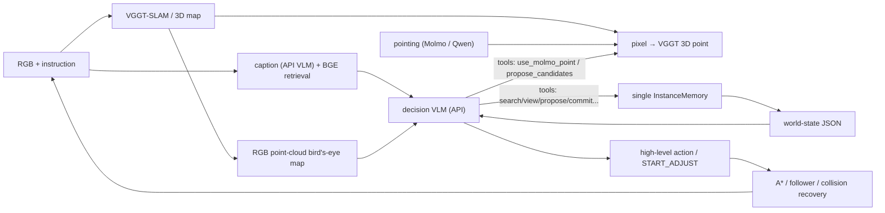

# VGGT-Nav Agent 当前架构

## 1. 设计目标

本系统是一个面向多目标具身导航的 VLM harness，仿照 coding agent 的思路：
确定性模块充当 VLM 的"感知、记忆与执行工具"，VLM 自己规划探索路径、
决定何时检索、何时实例化、何时报告。语义链路（caption 检索 → 看图 →
pointing → 实例化 → 导航 → 报告）的每一步都是 VLM 可独立调用的工具；
首选候选事务将 pointing、语义审核与 3D 实例化分开，避免把未经核验的像素
直接写入导航记忆。

系统不维护 `belief anchor / confirmed / rejected` 等先验语义状态，也不建立
永久黑名单。凡是能由 VGGT 点云恢复出有效 3D 点的像素都可以成为可导航
instance；类别与任务匹配关系由 VLM 根据证据持续判断。



## 2. 模块边界

| 模块 | 文件 | 职责 |
|---|---|---|
| SLAM 与语义服务 | `mapping/server.py` | VGGT 子图、caption 检索、pointing、像素到 3D、语义与图像诊断记录 |
| 关键帧策略 | `mapping/keyframes.py` | 组合光流阈值与最大观测间隔，保证弱纹理直行时仍定期刷新关键帧 |
| caption 语义记忆 | `mapping/caption_store.py` | 异步 caption worker、BGE-M3 向量索引与检索、落盘持久化 |
| VLM 网关 | `mapping/vllm_client.py` | OpenAI 兼容客户端：优先级队列、同帧缓存、重试；caption 与 pointing 各持一个实例 |
| 语义模型接口 | `mapping/pointing.py` | 双后端 pointing（qwen JSON / molmo XML 标签）、patch 深度采样 |
| 三层语义记忆 | `agents/memory.py` | 追加式 Observation、Canonical Instance、一次性 ReportClaim |
| 实体解析器 | `agents/entity_resolver.py` | 几何近邻召回 + 标注照片 VLM 比较，完成跨视角实例关联 |
| 决策状态 | `agents/decision_state.py` | 将实例、frontier、任务进度和几何代价组织成 JSON |
| 决策 harness | `decision/agent_loop.py` | 工具循环（默认最多 15 轮）、动作 schema、ID 校验与 trace |
| 决策提示词 | `decision/prompts.py` | 系统契约、事件说明和 world-state prompt 组装 |
| 高层状态机 | `agents/nav_agent.py` | 感知—记忆—决策—执行闭环及确定性降级 |
| 几何执行 | `agents/navigator.py` | 占据栅格（射线法自由空间）、A*、路径跟随、碰撞恢复 |
| 探索 | `agents/skeleton.py` | 几何/语义统一 frontier、信息增益与骨架拓扑 |
| 路径排序 | `agents/planner.py` | VLM 不可用时的最近实例/TSP 回退 |
| 运维诊断 | `scripts/diagnostics/` | 重力、自由空间和点云的只读检查脚本 |
| 远端工具 | `scripts/remote/` | SSH 助手（`remote_ssh.py`）、跑批脚本与远端离线验证脚本；脚本内使用远端绝对路径，本仓库不引用 |

## 3. 语义感知链路（全部由 VLM 按需驱动）

系统采用候选事务而非自动 ground 入库。首选工具链是
`propose_candidates → commit_candidates`：Pointing 结果先作为不可导航
proposal 返回十字证据图，Decision VLM 批量给出三值审核，只有 ACCEPT 才
批量解析为 active instance。扫描和 caption 刷新绝不直接入库。

1. **caption**：每个关键帧由 API VLM（`NAV_CAPTION_API_MODEL`，当前为
   qwen3.7-plus + `enable_thinking=false`，`NAV_CAPTION_WORKERS=4` 并发）
   生成查询无关描述——首行 `Scene context:` 单独记录可能的房间类型与固定
   设施，次行 `Objects:` 列类别（每类一次），随后逐实例一句自然语言内在
   属性描述（实例描述不含位置/空间关系，跳过 wall/floor/ceiling，
   window/curtain 保留），BGE-M3 建立文本检索索引；
2. **search_frames(query, top_k)**：BGE 检索相关关键帧，返回
   `[{frame_id, score, caption}]`；
3. **view_frame(frame_id)**：把关键帧原始 RGB 附到 VLM 下一轮输入，
   VLM 亲眼核实；
4. **use_molmo_point(frame_id, query)**：调用 pointing 模型只返回像素坐标，
   不注册任何实例。backends：
   - `molmo`（当前默认，`NAV_POINTING_BACKEND=molmo`）：Molmo-7B-D-0924
     经本地 vLLM 服务，输出 `<point>/<points>` XML 标签，0-100 归一化
     坐标，无 bbox/confidence；
   - `qwen`：JSON 输出绝对像素坐标 + 可选 bbox 交叉验证。
   返回给决策 VLM 的坐标统一为 0-1000 归一化（x 向右、y 向下）；
5. **review_crosshair(frame_id, pixel_1000, verdict, reason)**：旧的单点兼容
   接口；新代码优先使用批量 `commit_candidates`。Decision VLM
   对已展示的十字证据图给出 `ACCEPT / REJECT / UNCERTAIN`。只有 `ACCEPT`
   允许实例化；后两者记录为 `semantic_rejections`，绝不入实例记忆；
6. **instantiate_points(frame_id, pixels_1000, label)**：把 0-1000 归一化像素
   坐标变成可导航 3D 实例。`pixels_1000` 可来自 `use_molmo_point`，也可以是
   VLM 看过帧图像后自己给出的坐标。先生成标记证据面板，再由
   `review_crosshair` 的显式 `ACCEPT` 作为 2D 语义硬门；随后才进行 VGGT
   confidence 过滤、patch 深度采样和 3D 坐标恢复。深度无效的候选进入
   `geometry_rejections`；通过两阶段后才形成 Observation，再由 Entity Resolver
   关联到 Canonical Instance；
7. 同帧重复实例化先按 `candidate_id`、像素距离或 bbox IoU 确定性幂等；
   非重放 Observation 先在 1.2m 内召回最多 3 个 Canonical Instance，再把
   新照片及候选实例的标注照片交给专用 VLM 判断 `SAME / NEW / UNCERTAIN`。
   只有 `SAME` 会关联已有实例；跨视角 `UNCERTAIN` 保留为 proposal，等待
   新证据，不直接新建可导航实例。该 VLM 调用同时更新实例描述，不额外占用
   决策 VLM 的 15 轮工具预算。

### SAM mask 精化与 SoM 全分割

`mapping/sam_backend.py`（server 端，惰性加载 `segment_anything`，
`NAV_SAM_CKPT`/`NAV_SAM_MODEL_TYPE`/`NAV_SAM_DEVICE`/`NAV_SAM_ENABLED`
配置；未安装或权重缺失时自动禁用并退回旧行为）：

- **点提示精化**：`point_pixels`/`prepare_pixels`/`instantiate_pixels`/
  `point_frame` 拿到的每个粗落点先经 SAM 点提示分割，用 mask 质心替换
  原始像素、mask bbox 作为证据裁剪框；深度采样优先在 mask 区域内取
  中位数（`sample_point_depth(mask_hw=...)`），不再受 patch 边缘背景
  污染。候选注册的 mask 也随之从合成圆盘升级为真实实例 mask，
  `resolve_candidate` 重采样时复用。
- **SoM 全分割（升级路径）**：`som_segment(frame_id)` 用 SAM automatic
  mask generator 输出整帧物体级 mask（过滤面积 <0.2% 的碎片与 >55% 的
  背景区域），渲染编号 overlay 返回给决策 VLM；VLM 用
  `som_pick(frame_id, mask_ids, query)` 把选中 mask 注册为 proposal
  （质心为候选像素），后续走与 `propose_candidates` 完全相同的证据
  面板 + `commit_candidates` 流程。mask 在服务端按帧缓存（LRU 8 帧）。
  用途：pointing 模型反复把点落在背景/错误物体上（review 连续 REJECT）
  时，由决策 VLM 自行把"生成坐标"降级为"选择题"。

建图不把每个观测都作为关键帧。默认在相对上一关键帧的平均光流超过 40
像素时取帧；即使光流不足，也最多间隔 3 个观测强制刷新。每个子图包含
16 个新关键帧，并与下一子图共享 3 帧。

工具返回前会等待 caption worker 消化完已入队关键帧（`caption_pending`，
有界等待，超时继续），避免异步 caption 漏掉刚看到的场景。

### 3.1 几何覆盖、语义检查与统一 frontier

地图保留两个职责不同的 bool 层：

- `geometry_observed`：该格是否有可靠 VGGT 3D 覆盖；
- `semantic_inspected`：可通行格是否已有足够语义观察（已完成 caption 的
  关键帧，一次近距离观察，或至少两个满足最小基线和方位角差的观察）。

`traversed` 诊断层只表示机器人真实执行轨迹，不参与 A* 或 frontier。

自由空间由**射线法**生成：VGGT 点云因漂移/回环会产生垂直鬼影层，单一
全局地板高度会漏掉大部分地板。当前实现为每帧相机对观测点子采样 400 条
射线，躯干高度带（地板上 0.25–1.6m）内经过的格子标为 free；被 ≥5 条
射线穿过的障碍格判定为鬼影并清除。地板高度按分块局部估计（全局峰锚
±0.35m 窗口内取局部中位数），障碍孤立点需票数 ≥2 或有邻居才保留。

对决策层只暴露一套 frontier：几何 frontier 与语义 frontier 取并集后统一
聚类、A* 可达性过滤和冷却。每个候选带 `reason`、两类 gain、路径代价和
utility。

## 4. 三层去重记忆

### 4.1 Observation：采集幂等层

每次有效 2D→3D 结果产生一条追加式 Observation，保存 `observation_id`、
3D 点、frame/candidate、像素、bbox、置信度和原始文本。`candidate_id` 只是
mapping 证据句柄，不被当作跨视角物体身份。同一 candidate 的重放，或同帧
近像素/高 bbox IoU 的重复调用，只补充证据索引，不产生第二条 Observation。
Observation 的身份与原始证据不变；SLAM 回环后只允许通过 candidate 句柄
刷新其 3D 点。

### 4.2 Canonical Instance：物理实体层

`InstanceNode` 是供导航和决策引用的稳定实体，包含 `id`、`text`、
`observation_ids`、证据集合、当前导航点和 `report_claim_id`。Entity Resolver
先用 3D 距离做候选召回，再用不同照片中的标记区域判断是否为同一物理物体，
不会仅凭类别相同或距离接近合并。实例导航点取关联 Observation 中质量最高的
真实 3D 点，不对不同视角点做坐标平均；回环后仍可由 candidate 重投影刷新。

关联结果采用三态生命周期：`proposal → active canonical instance →
reported instance`。`SAME` 绑定已有 canonical ID；`NEW` 新建 active；
`UNCERTAIN` 保持 proposal，不参与导航。旧的人工 `merge_instances/undo_merge` 已删除，
避免错误合并后破坏证据来源和报告状态。召回半径、候选数分别由
`NAV_ENTITY_CANDIDATE_RADIUS_M`（默认 1.2m）和
`NAV_ENTITY_MAX_CANDIDATES`（默认 3）控制。

### 4.3 ReportClaim：报告幂等层

一次合法 `REPORT_FOUND` 创建一条原子 ReportClaim：`claim_id`、
`instance_id`、报告 step 和当时已有的 `observation_ids`。Claim 不维护
camera/view pose，也不尝试推断 benchmark 的空间覆盖范围。一个 canonical
instance 最多产生一个 Claim；报告后该实例从可导航集合移入
`reported_instances`。`REPORT_FOUND.target_id` 必须等于当前 active canonical
instance，不能用另一个近邻实例或空 ID 代替。

## 5. 决策 VLM 的输入

每次事件决策包含三类输入：

- **world-state JSON**：任务账本（goal/mode/found/expected）、
  step/max_steps/steps_remaining、frontier 表（路径代价、几何/语义 gain、
  branch、失败数和新颖度）及 `frontier_branches` 局部路径分支摘要、
  导航状态（当前位姿、active target）、`notes`（VLM 自己的持久工作记忆，
  上限 500 字符，经 set_notes 维护）、`recent_actions`（最近 3 个高层
  动作及 ok/collision/arrived 结果，更早的经 get_action_history 分页查询）、
  `new_keyframes`（仅当存在：自上次决策以来收集的 `{frame_id, caption
  摘要}`，图像不自动附）、`relevant_frames`（每次决策按完整目标短语自动
  检索的 top-K caption 帧，默认 `NAV_RELEVANT_FRAME_TOP_K=5`；只是假设，仍须
  view/propose/三值审核）、实例表的有界摘要（top-K，文本截断，其余折叠为
  `instances_omitted_ids`，仍是合法导航目标；实例摘要携带
  `observation_count`。已报告实例通过 `reported_instances` 保留 canonical ID、
  文本、观测数和 claim ID，并同时提供 `report_claims` 账本）；
- **RGB 点云鸟瞰图**：VGGT-SLAM 点云重力对齐后严格沿 Z 轴正投影；默认
  stride 3 取点，只保留高度 2.2m 以下的点去除天花板遮挡，同像素内 RGB
  按高度带通权重融合（地板 1.0、家具最高 3.0），上限
  `NAV_DECISION_MAP_MAX_POINTS=2000000`。底图不编码 free/obstacle/coverage，
  不显示轨迹。蓝色箭头 = Agent 位姿，紫色菱形 `fN` = 可选 frontier，绿色
  圆圈 `tN` = 实例，橙色星形 = active target。点、颜色、位姿和 frontier
  来自 mapping server 同一次锁内 snapshot；
- **事件图像**：到达时的当前 RGB、SCAN 后的四向环视图、或工具请求的图像。

所有距离与路径代价由确定性几何模块预计算，VLM 不输出世界坐标（实例化用
的像素坐标除外），也不估算地图尺度。

## 6. 决策工具一览

VLM 在最终动作前每轮可调用一个工具，每次决策硬上限为 15 轮；
`NAV_DECIDER_MAX_TOOL_ROUNDS` 可将上限调低但不能超过 15。初始 prompt 明确
告知实际上限，每次工具结果
也携带 `已用/上限/剩余`。第 15 次工具返回后切换到独立的
final-action-only prompt；后续 `tool_call` 不执行也不进入 action 校验。若两次
最终动作请求仍无效，harness 直接选择合法的实例、frontier 或扫描动作，避免
以空 action 返回上层 fallback：

| 工具 | 返回与副作用 |
|---|---|
| `search_frames(query, top_k=5)` | `[{frame_id, score, caption}]`，只读 |
| `view_frame(frame_id)` | 下一轮附加该关键帧原始 RGB，只读 |
| `propose_candidates(frame_id, query)` | Pointing + 批量十字证据图，创建不可导航 proposal，只读 |
| `commit_candidates(reviews, label)` | 对已审核子集批量给出 `ACCEPT/REJECT/UNCERTAIN`；只解析 ACCEPT 并写入 active instance，未提交 proposal 保持 pending，写 |
| `use_molmo_point(frame_id, query)` | `{points: [{pixel: [x, y]}]}`，0-1000 归一化坐标，只读、不注册 |
| `review_crosshair(frame_id, pixel_1000, verdict, reason)` | 对已展示十字图记录 `ACCEPT` / `REJECT` / `UNCERTAIN`；只有 `ACCEPT` 允许实例化，写 |
| `instantiate_points(frame_id, pixels_1000, label)` | 像素 → 显式 ACCEPT 语义审核 → 3D 深度/几何验证 → Observation → canonical instance；返回 `instances`、`semantic_rejections` 与 `geometry_rejections`，写 |
| `som_segment(frame_id)` | SAM 全分割编号 overlay + mask 元数据列表（0-1000 归一化 centroid/bbox/area_frac），只读 |
| `som_pick(frame_id, mask_ids, query)` | 选中 mask 注册为 proposal（质心为像素、mask 用于深度采样），随后走 commit 流程，写 |
| `search_instances(query, reported=null, top_k=10)` | 实例 text 关键词 OR 匹配，按命中数排序，只读 |
| `get_instance(instance_id)` | 完整实例记录（无图像），只读 |
| `view_instance(instance_id)` | 下一轮附加该实例证据图（pointing overlay 优先），只读 |
| `update_instance(instance_id, text)` | 只覆盖 text，写 |
| `get_agent_status()` | 建图/caption/实例/预算快照，只读 |
| `set_notes(text)` | 覆盖 notes 工作记忆（≤500 字符），写 |
| `get_action_history(before_step, limit)` | 分页查询更早的动作流水，只读 |

所有工具结果统一为 `{ok, tool, state_changed, result}`；失败统一为
`{ok:false, error:{code,message}}`。图像工具返回可追踪的 `image_ref`，实际
附件使用 `tool_frame_<id>_rgb` 或 `tool_instance_<id>_evidence` 标签。工具不能
伪造或直接改写 3D 坐标、路径代价和 `reported` 状态。写工具成功执行后，
harness 重新生成 world-state 并随工具结果下发。

semantic mapping server 启动时必须调用 `/v1/models` 探测 pointing endpoint，
并确认 `NAV_POINTING_MODEL_PATH` 对应模型已加载；探测失败直接终止启动。
独立 caption API 还必须执行一次最小真实生成（默认开启，
`NAV_REQUIRE_CAPTION_PREFLIGHT=1`），因为 `/models` 无法发现欠费、鉴权和生成
配额错误；失败以 `CAPTION_BACKEND_UNAVAILABLE` 终止。Decision VLM 同样在
创建决策循环前执行最小 JSON 生成（`NAV_REQUIRE_DECISION_PREFLIGHT=1`），失败
以 `DECISION_BACKEND_UNAVAILABLE` 终止，避免整个 episode 在盲目回退中耗尽。
运行中 endpoint 失效时，`use_molmo_point`/`propose_candidates` 返回稳定错误码
`POINTING_BACKEND_UNAVAILABLE`，不得降级成空 points/results。该错误只表示
基础设施不可用，不构成“图中没有目标”的语义证据。

## 7. VLM 最终输出

VLM 必须输出一个 JSON 对象：

```json
{
  "action": "GOTO_INSTANCE | GOTO_FRONTIER | REPORT_FOUND | SCAN | FINISH | START_ADJUST | END_ADJUST | MOVE_FORWARD | TURN_LEFT | TURN_RIGHT | LOOK_UP | LOOK_DOWN",
  "target_id": "GOTO_INSTANCE/GOTO_FRONTIER/REPORT_FOUND 的目标 id，其他动作使用 null",
  "reason": "简短推理摘要，仅用于日志"
}
```

事件允许的动作：

| 事件 | 允许动作 |
|---|---|
| `world_state_updated` | `GOTO_INSTANCE`、`GOTO_FRONTIER`、`REPORT_FOUND`、`SCAN`、`FINISH`、`START_ADJUST` |
| `arrival` | 同上 |
| `scan_complete` | 同上 |
| `finish_check` | `GOTO_INSTANCE`、`GOTO_FRONTIER`、`FINISH` |
| `adjustment` | `MOVE_FORWARD`、`TURN_LEFT`、`TURN_RIGHT`、`LOOK_UP`、`LOOK_DOWN`、`END_ADJUST`（工具禁用） |

动作语义要点：

- `GOTO_INSTANCE`：到达目标的方式就是"先实例化再导航"——对只存在于
  图像中的目标盲目走 frontier 是无效的；
- `REPORT_FOUND`：报告**当前就站在旁边**的 active canonical instance，并
  创建一次性 ReportClaim。记忆实例只是未核实的
  假设；只允许基于到达时的 RGB 或 takeover 亲眼观察报告，禁止仅凭
  caption、记忆文本或工具返回的图片远程报告。many/all 模式不得重复
  报告同一物理实例；
- `SCAN`：原地 360° 环视（12 次左转、四个采样视角），只能看到当前位置
  可见的东西，无法看到物体另一面，不能用于核实候选；
- `START_ADJUST`：有界微调/主动观察，每轮一个原子动作，执行后收到新
  RGB，默认最多 10 步（`NAV_ADJUST_MAX_STEPS`）。benchmark 原生支持的
  `LOOK_UP/LOOK_DOWN` 每次改变俯仰 30°；相对中性姿态默认限制为 ±1 档
  （`NAV_ADJUST_MAX_TILT_STEPS`），`END_ADJUST` 后 harness 自动逐步回正再
  恢复导航，倾斜视角作为同一位置的现场观察证据保留。除此之外，同一
  target 的 session、累计步数和转向数分别受
  `NAV_ADJUST_MAX_SESSIONS_PER_TARGET`（默认 2）、
  `NAV_ADJUST_MAX_TOTAL_STEPS_PER_TARGET`（默认 8）、
  `NAV_ADJUST_MAX_TURNS_PER_TARGET`（默认 4）限制；连续同向转超过两次
  会冷却该 target 并回到探索，禁止 `END_ADJUST`/`START_ADJUST` 循环；
- `FINISH`：不可逆。many 模式数量不足时被 harness 拒绝并降级。

`EXPLORE` 已从动作表移除（VLM 曾滥用一键探索）；探索应显式选
`GOTO_FRONTIER` 或用 `START_ADJUST` 局部观察。harness 内部降级路径仍保留
同名常量。

程序只做结构性约束：动作属于当前事件、目标 ID 存在、导航实例尚未报告；
报告 ID 还必须等于当前 active canonical instance。

## 8. 执行闭环

`GOTO_INSTANCE` 解析为实例 3D 点，经占据栅格和 A* 生成路径，由
`PathFollower` 输出离散运动。回环优化后，各 Observation 通过其
`candidate_id` 重投影刷新坐标，Canonical Instance 再选取质量最高的真实
观测点作为导航点。碰撞、路径丢失和 frontier 失败计数仅用于执行恢复，
不表达语义否定。

导航前进无视觉位移时，不会在原栅格上重复规划：agent 先交替左/右转
`NAV_NAV_ESCAPE_TURNS` 次（默认 1），把撞击方向在下一次建图中作为半径
`NAV_NAV_BLOCK_RADIUS_M`（默认 0.35m）的临时障碍，且该障碍保留
`NAV_NAV_BLOCK_TTL_STEPS` 步（默认 80），随后重新 A*。只有连续达到
`NAV_NAV_COLLISION_LIMIT`（默认 3）次前进碰撞，才把当前实例标为
unreachable 并触发 `nav_failed` 决策事件；benchmark 没有后退动作，因此
恢复不产生不受支持的动作。

frontier 不维护依赖 VGGT 全局精度的永久房间标记。每次地图 snapshot 按
A* 的局部路径前缀分组为短期 branch，记录该 branch 的碰撞、成功移动、
新关键帧和最近尝试时间；重复且无新观察的 branch 自动降权。实例导航和
frontier 跟随共享“转向脱困 → 临时封路 → 重规划”的运动恢复语义。

所有米制消费者使用同一版本化 `MetricTransformSnapshot`。新尺度与当前值
差异超过 12% 时须连续三次一致才切换；切换才提升 revision，避免单次
VGGT 尺度漂移同时污染去重、路径代价、冷却半径和 target pool。revision
切换会废弃 follower、临时障碍和 frontier 路径，并从同一服务端 frame snapshot
重规划；目标导航不得混用独立 pose RPC 与点云 RPC。

前进受阻先由连续两帧 RGB 静止确认（`MAPPING_STUCK_CONFIRM_STEPS=2`），避免
低纹理墙面把单次正常前进误判为碰撞。adjust 的 `END_ADJUST` 也不是自由退出：
verify_instance 至少要有新视图、clear_path 至少成功前进一次、inspect_sector
至少产生一个 mapping keyframe；否则 harness 继续一个有界的观察动作。

到达实例后由决策 VLM 直接查看当前 RGB 和候选证据，决定报告、离开、
换目标或 START_ADJUST；到达本身不强制微调。`act()` 常规跟随和 VLM 刚下发
`GOTO_INSTANCE` 后的即时跟随共用同一个 arrival transition，因此零长度路径/
已在阈值内也会当轮审核，不会被误转成探索。实例路径规划失败时立即清除
active target，避免物理控制在探索而 world-state 长期保留旧目标。

## 9. 诊断与可复盘输出

所有输出统一放在 `debug_output/<run-id>/`（`NAV_DEBUG_ROOT` + `NAV_RUN_ID`
隔离），按职责分为 `agent/`、`mapping/`、`benchmark/` 和 `diagnostics/`。
不保存 API key；图像 base64 默认不落盘，仅在显式打开 trace 开关时内联。

| 产物 | 内容 |
|---|---|
| `action_trace.jsonl` | 每步实际 Habitat 动作、agent mode、当前目标、碰撞状态 |
| `decision_trace.jsonl` | 事件、校验后高层动作、理由、工具调用与校验结果 |
| `vlm_calls.jsonl` | 决策/实体解析 VLM 的 prompt、图像标签与哈希、原始响应；`NAV_VLM_TRACE_INLINE_IMAGES=1` 时内联图像 |
| `entity_resolution.jsonl` | 每条 Observation 的几何候选、距离、视觉判定和最终 canonical ID |
| `vlm_caption.jsonl` / `vlm_pointing.jsonl` | mapping 端 caption/pointing VLM 按角色拆分的完整调用记录 |
| `<episode>_frames/` | mapping server 收到的全部 RGB |
| `<episode>_frame_captions.jsonl` | 每帧的 `frame_saved` 与关键帧 `caption_result` |
| `<episode>_queries.jsonl` | caption 检索、ground_object 与 3D 候选诊断摘要 |
| `vlm_inputs/` | 实际进入决策 API payload 的图像 |

`scripts/pretty_vlm_log.py` 把 JSONL trace 转成可读目录（每条调用一个
子目录：prompt.txt + images/ + output.json + index.md）。
`scripts/diagnostics/` 下可重放 occupancy/frontier 构建做只读检查。

## 10. 确定性降级

启动后的单次非法结构仍可确定性回退：优先最近的未报告实例，否则最高
utility 的可达 frontier，再否则基础探索。已配置的 Decision/Caption 后端若
连最小生成预检都失败则启动即中止，不允许把鉴权、欠费或服务故障伪装成
长期确定性降级。frontier utility 由加权几何/语义信息增益、路径代价和执行
失败次数构成，不含目标类别 belief。

## 11. 当前边界

- pointing 精度是感知链路的主要瓶颈。本地 7B Qwen2.5-VL 对远距小目标
  系统性失准（指到前景大物体），已切换 Molmo-7B-D-0924 后端，实测对
  远距小目标召回显著更好，但有一定误报率（误指实例靠标注文本让决策
  VLM 自行排除）。Molmo 为 bf16，需 ~17GB 显存，与 VGGT-SLAM 在 24GB
  显卡上无法共存，需 40GB+ 显卡或分卡部署；
- 决策 VLM（API 模型）自己读图给像素坐标的能力受 API 侧图像缩放影响，
  0-1000 归一化约定可吸收 resize，但精度未经系统验证；
- 跨视角实例关联依赖标注照片的专用 VLM 判定；遮挡、视角差过大或证据图
  过期时按 `UNCERTAIN→proposal` 保守处理，既不误合并，也不创建可导航、
  可报告的假实例，等待后续视角消歧；
- `REPORT_FOUND` 依赖 VLM 在目标旁的直接观察，主要风险是图像语义正确
  但报告位置未满足 benchmark 近距离阈值；
- 完整效果需要在真实模型、VGGT-SLAM 服务和 benchmark episode 上做闭环
  评测。

## 12. 评测采集接口 `get_target_pool()`（只读旁路）

benchmark 评测器在每步 `act()` 之后调用 `NavAgent.get_target_pool()`，
统计"已实例化但未上报的目标"（U_t）与发现池质量。该接口是纯只读旁路：
不写任何导航/决策状态，不复用也不影响 `NAV_ORACLE_GEOMETRY` 消融
开关，不做网络/磁盘 IO，O(实例数)，每次调用现算（实例点随回环刷新，
不缓存结果）。

**契约**：`list[dict]`，每项 `{"position": [x, y, z], "reported": bool,
"label": str}`。包含当前 episode 至今实例化过的所有 canonical
instance（`self.memory.nodes`，含已上报的，`reported` 标志区分）；
`position` 为 habitat 世界系坐标（米，y-up）；`label` 为
`InstanceNode.text` 截断 100 字符。数据不可用（锚点或尺度未建立）时
返回 `[]`，绝不抛异常。

**坐标变换**（对齐 SLAM 系 → habitat 世界系的近似相似变换）：

- 锚点：episode 首个 `act()` 中首个有效 `(gps, compass)` 记录一次
  （`_capture_pool_world_anchor`）；SLAM 侧锚点为重力对齐系中最早
  关键帧的位姿 `(x, y, z, yaw)`（`_update_pool_slam_anchor`，在
  `_plan_exploration` / `_refresh_anchor` 用已有位姿快照每次重规划
  刷新，跟随回环对历史位姿的改写）；
- 尺度 s：`calibrator.current_scale()`（m/unit），缺失时回退
  `_frontier_grid.unit_per_m` 的倒数，两者皆无则返回 `[]`；
- 符号约定假设：compass 是绕世界 +Y 的右手 yaw，`compass=0` 时 agent
  面向世界 −Z，forward = (−sin c, 0, −cos c)（与 benchmark
  `evaluator._agent_compass` 的四元数转 yaw 一致）；对齐 SLAM 系为
  右手 z-up。两手坐标系的水平面基序 (x_s, y_s) 与 (x_w, z_w) 手性
  相反，因此平面映射是反射+旋转而非纯旋转：

  ```
  ψ_w = atan2(−cos c0, −sin c0)     # 世界 forward 在 (x_w, z_w) 平面的角
  α   = ψ_w + yaw_s0
  wx = g0x + s·(cosα·dx + sinα·dy)
  wy = g0y + s·(pz − az)
  wz = g0z + s·(sinα·dx − cosα·dy)
  ```

**近似误差来源**：SLAM 漂移随时间累积（晚实例化的点误差更大，锚点只
在重规划时刷新）；尺度来自在线动作标定（撞墙/回环会污染）；首帧
SLAM 位姿对应 step-0 观测、`pose_to_yaw_2d` 的相机 +Z 为朝向等假设
若被服务端改动会破坏对齐；若发现系统性镜像/固定角度偏差，首要检查
compass 符号约定。该接口只服务评测统计，不进入导航主路径。
