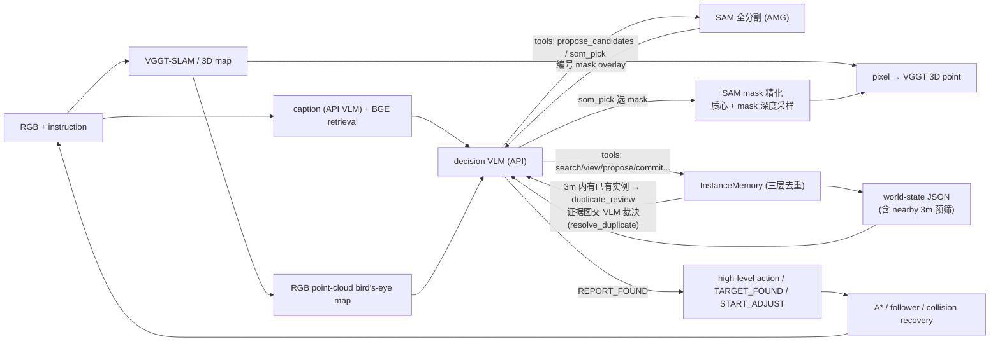

# 论文大纲与实验叙事

## 1. 论文定位与主线

**核心贡献是 benchmark；agent 是基线并提供诊断。**

叙事主线：任务提出自主目标选择、任务进度维护与完成判断需求 → 指标定义如何量化agent的能力 → agent 提供baseline → 实验展示性能、决策机会和具体瓶颈。

## 2. 正文章节安排

### 1. Introduction

- 具身导航是具身任务的基础，随着具身智能的发展，具身导航备受关注。
- 列出现在具身导航benchmark的发展，指出它们focus on lifelong的顺序多目标。
- 这实际上是对单目标任务的拼接，缺少决策空间来量化agent的规划能力，缺少对实例的状态维护能力的考查。
- 通过接待客人时 “找3个椅子”  和洗衣服前 “找到所有衣服” 这样的现实任务需求，引出目标子集选择、访问排序、实例追踪和未知数量下的终止判断。
- 提出 MOS/MOC、结果指标与过程诊断，以及可审计的参考 agent。
- 贡献收敛为三项：任务与数据；评测与诊断体系；系统baseline与实证发现。

### 2. Related Work

**2.1 From Sigle to Multi-Goals**

- 单目标 ObjectGoal Navigation（Habitat ObjectNav、HM3D-ovon）把任务限定为到达某类别的一个实例，成功判定是"是否到达"——无需维护多目标进度，也不考查目标之间的取舍；
- 以 MultiON、GOAT 为代表的多目标导航 benchmark，本质上是将"多目标导航"简化为"给定顺序的多次单目标导航"；
- 目标顺序由指令显式给出，agent 只需按序执行 "go to A → go to B → go to C"，每个子任务的决策空间退化为单目标导航问题，Agent 不需要在多个候选目标间做取舍、排序、路径整体规划；
- 这对 working memory 的要求很弱，只需记住"当前子目标是谁"，无需维护"已找到哪些"和"去过哪里"的复杂状态；
- 我们的benchmark更进一步，利用 MOS/MOC 补上对搜索规划，实例记忆维护和终止决策能力的测评；
- 评测方法论上接续 SPL与 MultiON 的多目标指标；但过程级诊断（U_t、TSE/OE，见 §3.3）在现有 benchmark 中普遍缺位。

**2.2 VLM for Exploration and Reasoning**

- VLM 在解决具身导航问题上有前景，但对空间的理解和记忆是 VLM 的弱点，需要外部的表征来辅助 VLM。现有方法从表示形式和交互范式两个互补方向展开，但均未解决开放世界多实例收集的核心挑战。
- 在场景表示方面可分为三种范式(1) 3D Scene Graph：MSGNav、SG-Nav和 PSG-Nav 将环境建模为物体节点和关系边，使 agent 能利用物体间的语义和空间关系进行导航。然而，scene graph 的预构建开销大，且将复杂空间关系简化为离散文本描述或RGB图片，难以支持精细的空间推理。3D-Mem 提出用 Memory Snapshot 替代 scene graph，虽然保留了更丰富的视觉信息，但其高层决策仍基于离散图片，缺乏对全局空间拓扑的认知。(2) BEV / 语义地图：TopV-Nav将鸟瞰图与物体 bounding box 作为 MLLM 的输入，利用其空间推理能力进行零样本目标导航。3DGSNav、IntentNav和 VLFM也在 BEV 或语义地图上标注目标点或前沿点来引导 VLM 决策。虽然这种压缩简化了空间规划，但在需要实例级视觉验证时，VLM 无法从压缩后的 BEV 中恢复原始视觉证据。(3) 3D 特征场 / Query-based：MTU3D  提出在线 query 表示学习，从 RGB-D 流中实时提取物体 query 和前沿 query，统一了 grounding 与 exploration 的优化目标。但其表示是压缩后的隐式向量，语义不可读，且依赖深度传感器和已知位姿，限制了在纯 RGB 场景下的适用性。本文基于 VGGT 的单目重建直接维护原始点云，配合 VLM 生成的自然语言 caption，在 query 时刻动态实例化语义区域——既避免了全图预构建的开销，又保留了完整几何与显式可读语义，使 VLM 能够直接基于点云密度和 caption 检索进行空间聚类推理与覆盖评估。从结构化场景表示上。
- 在交互范式方面，现有方法通过外部记忆或工具调用扩展 VLM 能力，但交互方式较为僵化。MemoNav、RAVEN 等将历史观测以帧、片段或 embedding 形式存入外部记忆，需要时检索召回——记忆内容由感知流水线自动写入，VLM 只能被动接受召回结果，无法追问"某个候选是否为新实例"，更不能修正记忆本身。 AgenticNav 将深度查询、视觉回忆、移动等感知与动作原语封装为工具，让 VLM 在"思考-行动"循环中主动与环境交互；但这些工具只作用于环境与即时感知，场景记忆仍由流水线被动累积——VLM 不能对记忆本身追问、核实与修正，例如裁决两个观测是否同一实例、撤销一次错误的记忆写入。值得注意的是，harness 式的工具组织在操作领域已被验证有效（Guava），但在导航领域尚未与可写的场景记忆结合。本文的工具作用对象不止环境与即时感知，还包括两层可读写的记忆：一是 VGGT-SLAM 在线重建的点云空间记忆——frontier、覆盖状态、路径代价与 BEV 态势都由它提取和预计算，目标候选经 SAM 分割反投影实例化为其中的 3D 位置；二是对 VLM 开放写入的语义记忆——感知产出经 VLM 审核后才成为可导航实例，重复实例可合并、文本可修订、notes 可自行维护。VLM 据此按需索取信息、核实候选并参与记忆维护，形成"调查-核实-入账"的主动闭环，从而在多实例收集任务中做出有全局意识的主动决策。

### 3. Benchmark 

**3.1 任务定义**

- 任务规则定义（观测输入、动作输出、成功标准、agent规格）。
- MOS：数量已知、顺序未知。
- MOC：总数未知，要求找全并主动停止。

**3.2 数据构建与统计**

- 数据集生成pipline：场景来源、目标标注、查询生成、可达性筛选、自然语言生成。
- 数据统计：场景数、episode 数、目标数量、目标分布、目标类型。

**3.3 评测指标体系**

| 层级 | 指标 | 定义目的 |
|---|---|---|
| 主结果 | SR、F1、SPL-multi；补充 Precision/Recall | 衡量成功、报告准确完整性及成功条件下的路径效率 |
| 过程诊断 | 池覆盖、池质量、TSE、OE、LE、RTSR、停止相关量、NE、OSR | 区分总分背后的不同表现特征 |
| 行为证据 | `U_t`、目标非贪心与路线比较、预算分段动作分布 | 观察选择机会、首选目标价值和行动调整 |

- 正文给出核心定义；求解近似、匹配阈值、缺失值和聚合规则放附录。

### 4. Reference Agent

参考 agent 承担双重角色：任务的 baseline，并且实证benchmark能够量化agent的水平。

**4.1 Harness 架构：VLM 决策核心 + 确定性工具层**

仿照 coding agent 的组织方式：VLM 只做高层认知（规划、检索、核实、裁决），感知增强、记忆管理与动作执行全部由确定性模块承担，并包装为 VLM 可按需调用的工具：

- 感知工具：caption 检索（BGE）、查看任意关键帧、SAM 全分割选目标、像素→3D 实例化；
- 记忆工具：VGGT-SLAM建图、实例文本修订、重复实例合并、分页动作历史、VLM 自维护 notes；
- 执行工具：frontier/实例导航、SCAN、报告与终止。

决策是事件驱动的：导航执行到底，只有到达、frontier 耗尽、caption 检索命中等事件点才交还 VLM，决策密度降至每 300 步 12–20 次，VLM 的上下文只花在真正的决策点上。

**4.2 VGGT-SLAM：harness 的 3D 记忆**

harness 的全部空间状态——占据栅格、frontier、实例坐标、路径代价、鸟瞰图——都建立在同一个在线点云地图上，其建图后端是 VGGT-SLAM：RGB 帧在线喂入，VGGT 前馈重建各帧深度与相机位姿，子图位姿图与回环闭合把局部观测组织成全局一致的点云。单目重建只恢复 Sim(3) 相对尺度，系统用在线尺度标定（多帧地面–相机高度尺规）恢复米制几何，作为距离、到达半径与去重半径的共同基准。

VGGT 点云的固有误差由 harness 的确定性模块吸收，而不是暴露给 VLM：尺度漂移由标定模块锁定；漂移/回环产生的垂直鬼影层由射线法自由空间清除；占据栅格与 A* 在清理后的地图上运行。语义实例的 3D 坐标来自 SAM mask 在点云上的反投影与深度采样，而不是模型的坐标猜测。

**4.3 为什么 harness 与多目标 benchmark 适配**

MOS/MOC 任务的要求恰好落在"端到端 VLM"与"纯启发式管线"都不覆盖的中间地带，harness 是针对这一错位的架构选择：

- **长时程上下文**：一个 episode 长达数百步。端到端 VLM 逐步决策不仅调用成本高，视觉上下文还会随步数膨胀，早期观察被挤出窗口，而且其中大部分决策并不重要。harness 把低层控制交给确定性执行器（GOTO 执行到底，事件点才交还），决策密度下降约60%，VLM 的注意力只花在真正的决策点上。
- **记忆（实例状态维护）是 harness 的强项**：MOS/MOC 要求可靠维护"找到过哪些、是否重复、哪里还没探索"。harness 把这些状态外化为显式数据结构：Observation / Instance /ReportClaim 三层记忆保证实例身份与报告幂等；world-state 在每次决策时重建任务账本与最近动作；notes 与分页动作历史让 VLM 自己维护长期工作记忆。记账的正确性、持久性与可审计性由确定性代码保证，VLM 只负责基于记忆做判断。
- **几何与数值须精确**：尺度、路径代价、可达性、3m 去重半径都是连续数值，VLM 的数值估计不可靠。harness 预计算全部几何量以下发，VLM 不输出世界坐标、不估算尺度。
- **目标选择、属性判别、终止判断**："这堆候选里哪个最可能是目标""这个区域探索充分了吗、能不能停"依赖语义常识与不确定推理，启发式方法写不出通用规则，harness 恰好把这些决策留给 VLM。实例池让多个已发现候选并行存在，配合预计算的路径代价，目标选择成为显式决策点（这是后文 U_t 分析的结构来源）。
- **搜索与重访**：harness 用几何+语义双层 frontier 分别显式跟踪，caption 检索让已经看过的区域可以被语义回访，SCAN 处理冷启动。

尺度恢复、自由空间处理和工程阈值放附录。

### 5. Experiments

**5.1 Setup**

- 测评的方法（3dmem、MTU3D、ours）

**5.2–5.8 分析**

| 小节 | 放哪些实验与指标 | 推荐呈现 | 结论与指标的作用 |
|---|---|---|---|
| **5.2 Overall Performance** | MOS/MOC 分别报告 SR、F1、SPL-multi、P/R、样本数 | 主结果表 | 建立参考性能；用部分完成指标区分“同样失败但完成程度不同”。单系统低分不能独自证明 benchmark 有效或普遍困难 |
| **5.3 Scaling with Task Difficulty** | 按目标数量、场景规模、描述类型分组的 SR、Recall、SPL-multi | 少量分桶曲线及置信区间 | 展示性能如何随目标数量变化；复杂的任务对agent架构要求更高；控制/分层报告每个episode |
| **5.4 Completion versus Stopping in MOC** | 找齐率、正式 SR；找齐并停止/找齐被截断/未找齐主动停/未找齐被截断四类比例；找齐后额外步数、提前停止遗漏数；Stopping Regret 作补充 | 四类结果分布 + 停止成本图 | 分开观察搜索完成与宣布完成；原始量解释问题，Regret 概括代价。未找齐被截断不能直接归因为停止错误；找齐后继续探索不一定意味着当时已有充分停止证据 |
| **5.5 Decoupling SPL ：Searching and Planning** | 池质量、TSE、OE、LE 四因子 + RTSR（单列） | 开篇给出分解等式；log 损失堆叠分解图（乘性转加性）；因子几何均值表；搜索/规划两轴散点 | 核心等式 $SPL\text{-}multi = S \times (Q_{pool} \times LE) \times (TSE \times OE)$：完成度由 $S$ 承担，效率项乘法归因到搜索侧（发现候选 + 探索移动开销）与规划侧（子集选择 + 访问排序），"同样的低 SPL"由此可区分"没找到"与"没排好"。LE 在确定性执行器下主要反映探索移动，归搜索侧而非低层执行；MOC 无 TSE（分解只三项）、池不覆盖时池质量可 >1、精确/近似 TSP、池不足/未完成单独标识；四因子是归因不是因果失败占比；RTSR 属目标记忆，不进乘法链 |
| **5.6 Target Choice Opportunities and Value** | `U_t` 机会覆盖率；目标非贪心率；离线首选路线比较的胜/平/负及代价差 | 机会覆盖图 + 路线代价差分布 | `U_t` 说明实际出现多个候选；路线差异说明选择具有代价后果；比较 VLM 首选是否比最近目标更有利。具体口径见第 3 节 |
| **5.7 Budget-Related Action Changes** | 按原始预算剩余比例统计探索、目标访问、核验/调整、报告、主动停止；MOS/MOC 分开 | 分段动作分布 + 样本量；必要时按进度分层 | 展示行为是否随预算阶段变化。进度和候选条件相近时仍有变化，支持与预算压力相关的调整；不声称单凭分布变化证明因果或更优策略 |

### 6. Discussion and Conclusion （todo）

- 用 5.2–5.8 的证据回答三个问题——任务是否制造了自主选择机会（`U_t`）、选择是否有代价后果（路线比较）、停止与预算是否构成真实决策压力（停止分解、预算行为漂移）。判据是各环节都被实证制造出决策空间，而不是参考 agent 分数低。
- SPL 乘法分解把效率损失归因到搜索侧与规划侧；失败现象与诊断指标一一对应，指明改进落点。
- MOS/MOC 补上多目标导航"并行搜索规划"的评测空白；回收三项贡献（任务与数据、评测与诊断、参考系统与实证发现）。
- and more