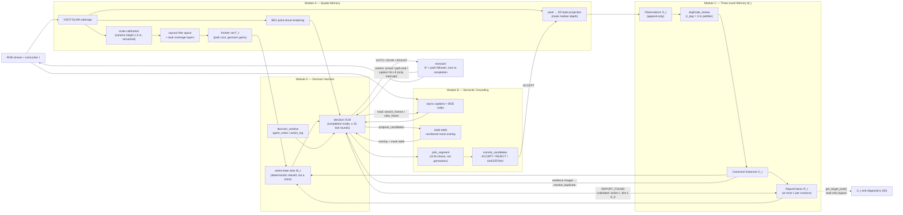

# 论文

## 1. 正文章节安排

### 1. Introduction

Embodied navigation is a foundational capability for embodied tasks ranging from household assistance to warehouse order-picking because agents typically need to reach a target location before executing downstream manipulations. As embodied intelligence advances, a series of benchmarks have emerged to quantify how well agents navigate.

Existing embodied navigation benchmarks have progressively extended the task horizon. Starting from single-goal episodes [Habitat ObjectNav], a line of works has moved toward sequential multi-goal navigation, in which the agent is assigned the next goal upon reporting completion of the current one, while retaining its memory of the environment across goals [MultiON, GOAT, LH-VLN]. This lifelong setting substantially extends the temporal scope of agent operation, making environmental memory retention and long-horizon efficiency important evaluation targets. However, regardless of how long the task horizon grows, the task structure itself remains fixed: goals, their order, and count are always given to the agent in advance.

Real-world service and household tasks, however, expose a property the line leaves untouched: how much of the task the agent must decide for itself. For instance, before hosting guests, a robot is asked to "find three chairs and bring them over"; before doing laundry, to "collect all the clothes scattered around the house"; in a restaurant, to "round up all the dishes." Serving such requests requires the agent to decide which subset of candidate instances to visit and in what order, to track which instances it has already found so that each is reported exactly once, and to judge whether the search is complete when the total count is not given. Existing sequential multi-goal benchmarks exercise none of these capabilities: (i) the goal order is prescribed by the instruction, so the agent never selects a subset or ranks its visits, whereas unordered multi-instance tasks induce a combinatorial space of subset choices and visit orderings; (ii) working-memory demands remain weak, as the agent tracks only the current sub-goal rather than the growing set of already-found instances; (iii) termination is never in question, since the goal count is known and a scheduler hands over the next sub-task; and (iv) existing metrics score the outcome of ordered execution but cannot attribute failure to a specific cause: whether the agent failed to recognize the targets, chose a poor subset, ordered a suboptimal visit, or stopped at the wrong time. We argue that these capabilities constitute a largely unexplored dimension for navigation benchmarks — decision autonomy: beyond how long agents operate, this dimension asks how much of a multi-object task the agent must plan and decide on its own.

To close this gap, we present XXX-Bench, a benchmark for multi-object navigation built around two tasks. In Many-Object Navigation (ManyON), the agent must find $k$ distinct instances that match the goal, in a visiting order of its own choosing, within a step budget. In All-Object Navigation (AllON), the total number of instances is withheld, and the agent must find every instance and actively signal completion once it judges the search to be complete. In both tasks, goals can be specified by a category name, a natural-language description, or a reference image. XXX-Bench comprises 750 episodes built on 36 scenes from the HM3D dataset, with controlled target counts, scene scales, and description types.

The evaluation protocol in XXX-Bench mirrors the four gaps identified above. A compact leader-board (Success Rate, Success Rate by Length, and de-duplication-aware Precision/Recall/F1) scores the final outcome, while process-level diagnostics attribute performance to its sources: a multiplicative decomposition of path inefficiency into search-side (coverage, search quality) and planning-side (target selection, ordering) factors measures how well the agent exploits its ordering freedom; a repeated-target-selection rate probes instance memory; and a stopping-regret measure evaluates termination decisions in AllON. Choice-opportunity statistics further verify that genuine decision spaces actually arise rather than being degenerate. Each diagnostic corresponds to a failure mode we observe in practice, rather than a purely theoretical construct.

We further contribute an auditable reference agent that serves both as a baseline and as a measurement instrument for the diagnostics above. The agent follows a harness design: the VLM performs only high-level cognition — planning, retrieval, verification, and arbitration — while deterministic modules handle perception, memory, and execution, all exposed as callable tools with fully traced decisions. Experiments show that XXX-Bench is far from saturated: the reference agent reaches only [X]\% success on AllON. Its failures are attributable rather than opaque — choice opportunities with multiple instantiated candidates arise in [X]\% of decision steps, non-greedy target choices carry measurable cost consequences, efficiency losses decompose cleanly into search-side and planning-side terms, and stopping emerges as a genuine decision point with non-trivial regret. 

To summarize up, our contributions are threefold:
\begin{itemize}
\item \textbf{Task and data.} We propose ManyON and AllON, two multi-object navigation tasks that operationalize decision autonomy — free visit order, mandatory deduplication, and, in AllON, self-determined termination — and construct XXX-Bench with 750 episodes across 36 HM3D scenes, supporting category, language, and image goal specifications.
\item \textbf{Evaluation and diagnostics.} We design a two-level protocol that pairs leaderboard metrics with process-level diagnostics, enabling failures to be attributed to search, selection, ordering, memory, or stopping, rather than collapsed into a single opaque score.
\item \textbf{Reference system and empirical findings.} We contribute an auditable harness-style VLM agent and show that XXX-Bench is unsaturated, creates genuine and consequential decision spaces, and supports precise localization of where current agents fall short.
\end{itemize}


### 2. Related Work

**2.1 Embodied Navigation Benchmark**

Existing embodied navigation benchmarks have mainly evolved along two lines, each substantially broadening what navigation systems are evaluated on. The first line expands how goals are specified: from object categories in a closed label set [Habitat ObjectNav], to open-vocabulary categories [HM3D-OVON], to goals given by category names, natural-language descriptions, or reference images [GOAT], and even to sounding targets localized from acoustic cues [SoundSpaces, AVLEN]. This line has freed navigation from fixed label sets, allowing goals to be expressed in whatever form users naturally provide. Yet while evaluation has shifted toward goal grounding and perceptual generalization, the underlying task structure — reaching one designated target at a time — remains unchanged. The second line extends the task horizon: from single-goal episodes to sequential multi-goal navigation, in which the agent is assigned the next goal upon reporting completion of the current one while retaining its memory of the environment across goals [MultiON, GOAT, LH-VLN]. This lifelong setting extends the temporal scope of agent operation, making environmental memory retention and long-horizon efficiency important evaluation targets.

Despite expanding different axes, both lines rest on a common structural assumption: the task structure is externally given. The goals, their order, and their count are prescribed by the benchmark, and the metrics score the outcome of executing that prescription rather than the decisions that produced it. Our work is complementary to both lines. We hold goal specification and task horizon as orthogonal axes — AutoNav-Bench supports category, language, and image goals in a long-horizon setting — and vary instead the degree of decision autonomy: which instances to visit, in what order, with what memory of past visits, and when to stop. This isolates a capability that neither line exercises or measures, and allows our tasks to be combined with any point along the two established axes.

**2.2 VLM for Exploration and Navigation**

VLMs are promising decision-makers for embodied navigation, but spatial understanding and long-horizon memory remain their weak points. A line of work seek to internalize spatial memory via training [NaVid,Uni-NaVid,MTU3D], endowing the model with native spatial reasoning and exploration capabilities without any hand-crafted representation — yet at the cost of massive trajectory data and no cross-VLM transferability. 

Training-free methods with external representations thus emerged - through interacting with them, VLMs can acquire spatial information and preserve long-horizon memory in a VLM-friendly form, freeing themselves from maintaining the scene internally. Rapidly advancing MLLMs accelerate this trend and three paradigms lead this wave. Semantic maps [VLMaps, L3MVN] embed language-aligned visual features into metric 2D/3D grids, which preserve geometry but discard fine-grained visual detail, and remain alien to VLMs that natively operate on images and text, requiring cumbersome textualization that further degrades the information. Scene-graph methods [SG-Nav] model the environment as object nodes and relation edges. VLMs can more effectively infer target locations by traversing these nodes and edges. Nevertheless, even when incorporating visual evidence onto relational edges [MSGNav], scene graphs struggle to preserve grounded spatial relations, as abstracting every environmental element into nodes often leads to bloated graphs and computational inefficiency. Image-based memories [MapGPT,3D-Mem] exploit egocentric snapshots to retain more visual information, yet decision-making still operates over discrete images lacking global spatial topology, and the memory inflates linearly with exploration length. These works reveal a triangular tension among fidelity, efficiency, and scalability. 

We resolve it with an interactive metric 3D representation: a VGGT-SLAM reconstruction rendered into marker-annotated views, coupled with on-demand raw-RGB retrieval and pixel-to-point grounding, through which a frozen VLM actively queries spatial layouts and instantiates 2D visual targets in it for navigation.

### 3. Benchmark 

**3.1 任务定义**

- 任务规则定义（观测输入、动作输出、成功标准、agent规格）。
- ManyON：数量已知、顺序未知。
- AllON：总数未知，要求找全并主动停止。

**3.2 数据构建与统计**

- 数据集生成pipline：场景来源、目标标注、查询生成、可达性筛选、自然语言生成。
- 数据统计：场景数、episode 数、目标数量、目标分布、目标类型。

**3.3 评测指标体系**

| 层级 | 指标 | 定义目的 |
|---|---|---|
| 主结果 | SR、F1、SPL-multi；补充 Precision/Recall | 衡量成功、报告准确完整性及成功条件下的路径效率 |
| 过程诊断 | 搜索覆盖 SC、搜索质量 SQ、TSQ、OQ、PE、RTSR、停止相关量、NE、OSR | 区分总分背后的不同表现特征 |
| 行为证据 | `U_t`、目标非贪心与路线比较、预算分段动作分布 | 观察选择机会、首选目标价值和行动调整 |

- 正文给出核心定义；求解近似、匹配阈值、缺失值和聚合规则放附录。

### 4. Reference Agent

参考 agent 不是来刷分的 SOTA 竞争者，它承担两个功能：**可解性 / 有效性证明**（任务是可以被一个合理系统做出真实决策的）和**诊断探针**（它的机制与留痕恰好产出 §5 所有诊断指标的数据）。全节每一小节都应能回扣这两个功能之一。

**4.1 Design Rationale：为什么必须是 harness**（动机，全节的智力核心）

从 ManyON/AllON 的任务需求出发，论证两个极端都不行：端到端 VLM 扛不住长时程上下文与精确几何，纯启发式写不出"哪个候选最像目标、能不能停"的通用规则。harness 恰好切走中间地带。五条论证压缩成一段设计原则：

- 长时程：episode 长达数百步，端到端 VLM 逐步决策成本高、视觉上下文膨胀，早期观察被挤出窗口，且其中大部分决策并不重要；
- 记账：要求可靠维护"找到过哪些、是否重复、哪里还没探索"，VLM 在长上下文中自行记账不可靠、不可审计；
- 精确几何：尺度、路径代价、可达性、去重半径都是连续数值，VLM 的数值估计不可靠；
- 语义判断：候选选择、属性判别、终止判断依赖语义常识与不确定推理，启发式写不出通用规则；
- 搜索与重访：已看过的区域需要能被语义回访，冷启动需要无目标探索。

harness 的定位由此导出：感知增强、记忆管理与动作执行由确定性模块承担并包装为工具，VLM 只做高层认知（规划、检索、核实、裁决）。

**4.2 Memory Architecture：三层记忆 + world_state 视图**（v2 改造的成果，显性呈现）

- 空间记忆：VGGT-SLAM 点云 / 占据栅格 / 关键帧库 / 尺度标定；
- 语义记忆：caption_store；instance_store 的 Observation / Instance / ReportClaim 三层；
- 工作记忆：agent_notes、action_log、decision_window；
- 代码方与 VLM 的可写性分明：底层结构由代码维护保证正确性，语义层对 VLM 开放写入（审核候选、合并重复、修订文本、维护 notes）；
- world_state 不是独立记忆，而是每次决策对三层记忆的确定性重建视图。这是"记忆是 harness 强项"这条论点的具体形态，也是和 MemoNav 式被动检索的区别所在。

**4.3 Spatial Memory：VGGT-SLAM 作为空间记忆载体**

不只介绍建图，重点是"全部空间状态同源"：frontier、覆盖、路径代价、BEV、实例 3D 坐标都从同一个在线点云派生；尺度标定、鬼影清除、反投影实例化由确定性模块吸收误差，VLM 永不输出坐标和尺度。感知 → 反投影实例化链条（caption 检索 → 查看帧 → pointing / SAM 选 mask → 反投影取 3D）在本节给出。误差处理压缩、细节放附录。

**4.4 Decision Loop：工具集 + 调查—核实—入账 + 事件驱动**（与 related work 对位的差异化贡献）

架构图放本节开头总览。

- 工具集按读 / 写 / 执行分组：读（caption 检索、查看帧、实例检索与检查、地图状态），写（实例化、文本修订、重复合并、notes），执行（GOTO、SCAN、REPORT、FINISH、ADJUST）；
- 调查—核实—入账：感知产出只是候选，经 VLM 审核（接受 / 拒绝 / 不确定）才成为可导航实例；重复实例可合并、文本可修订、notes 自维护。VLM 按需索取信息并参与记忆维护，而不是被动接收召回——与 related work 对 AgenticNav 的批评口径一致（那里写对比，这里给机制细节）；
- 事件驱动决策密度：GOTO 执行到底，仅到达 / frontier 耗尽 / 检索命中等事件点交还 VLM，决策密度降至每 300 步 12–20 次，VLM 的上下文只花在真正的决策点上（正式写之前用正式实验日志核数字）。

**4.5 Instrumentation：机制 ↔ 考点 ↔ 指标对齐**（全节的收尾，通往 §5 的桥）

benchmark 主导论文里最关键、也最容易被漏掉的一段。一张小表：

| 机制 | benchmark 考点 | 产生的指标 / 证据 |
|---|---|---|
| 实例池 + 预计算路径代价 | 目标选择成为显式决策点 | U_t 的结构来源（§5.6）；首选路线代价比较 |
| FINISH 显式化 | 终止成为可观测决策而非隐式超时 | §5.4 停止分析 |
| 三层去重 + 报告幂等 | 重复报告 FP 的防线 | 诊断指标归因 |
| 全程留痕（决策、工具、审核、尺度） | — | §5 所有诊断指标的数据来源 |

写完这段，reader 自然明白为什么 experiments 里那些指标"有数可算"。

**写作注意（降级或不写）**

- 28 个配置项、API 重试、截断口径、尺度标定细节 → 附录或实现细节小节，一句话带过；
- 不要声称 agent 本身的创新性超过"一个合理的 reference 设计"——它的贡献是和 benchmark 联合呈现的，单独拔高反而给 reviewer 攻击面；
- mermaid 图换成一张正式架构图（三层记忆居中，工具 / 执行两侧，world_state 视图标注），最好再加一个 episode 内 loop 的时序小图或 running example。

Section organization (module-based, per advisor feedback): §4.1 motivates the harness decomposition; §4.2 presents the architecture figure and gives the overall control loop (Algorithm 1); §4.3 develops the four modules — Spatial Memory (A), Semantic Grounding Pipeline (B), Three-Level Instance Memory (C), Decision Harness (D) — each under the fixed template **Problem → Input/Output → Processing → Why this design**, with Algorithm 2 formalizing the grounding-and-dedup pipeline that spans B and C; §4.4 maps every mechanism to the §5 diagnostics, closing the symbol loop.

### 4. Reference Agent 

The reference agent serves two functions: a baseline establishing reference performance on ManyON/AllON, and a measurement instrument — its traces feed every diagnostic metric in §5, and its measured behavior shows these metrics do quantify search and planning capability: choice opportunities arise, choices carry cost consequences, efficiency losses decompose into search- and planning-side terms, and stopping is a genuine decision. 

**4.1 Design Rationale: Why a Harness** (motivation; the intellectual core of the section)

Episodes run for hundreds of steps: step-by-step end-to-end VLM decisions are expensive, the visual context grows without bound and early observations are pushed out of the window — and most of those per-step decisions do not matter. The tasks require reliably maintaining "what has been found, what is a duplicate, what remains unexplored"; a VLM keeping such ledgers inside its own context is neither reliable nor auditable. Scale, path costs, reachability and deduplication radii are continuous quantities that VLMs estimate unreliably. Conversely, purely heuristic pipelines cannot express general rules for the decisions that actually matter — which candidate most likely matches the goal, whether an attribute satisfies the description, whether the search is complete enough to stop — while already-seen regions must remain semantically revisitable and cold start demands goal-free exploration. The harness occupies exactly this middle ground: perception augmentation, memory management and action execution are delegated to deterministic modules exposed as callable tools, and the VLM handles only high-level cognition — planning, retrieval, verification, adjudication.

**4.2 Overview: Notation, Architecture, and Control Loop**

Place the formal architecture figure at the start of this subsection (three-layer memory at the center; read / write tools and the execution stack on the sides; world_state annotated as a rebuilt view, not a store). Algorithm 1 replaces the previously planned episode-timeline figure.

Figure blueprint (adapted from the README system sketch: reorganized around Modules A–D to match §4.3; adds working memory, the duplicate-adjudication loop, the executor's caption-hit interrupt and the read-only `get_target_pool()` bypass; drops implementation-level nodes like TARGET_FOUND / collision recovery; symbols consistent with the prose). The final paper figure is a formal redraw of this blueprint:



No standalone notation table: every symbol is introduced in the prose at its first use, and any quantity that never reappears stays as words. The symbols that do carry through the section — $\mathcal{M}_t$, $W_t$, $\mathcal{F}_t$, $r_{dup}$, $d_r$, $\theta$ — are defined in the Algorithm 1 / Algorithm 2 explanations below or in their owning module, and metric symbols (e.g., $U_t$) are reused verbatim from §3.3.

**Algorithm 1 (event-driven episode loop).** Prose before: state its purpose — the control-flow fact that deterministic code executes actions to completion and the VLM is consulted only at event points. Prose after: explain the key lines, defining each symbol at first use — line 1 initializes the three-level memory $\mathcal{M}_t=(\mathcal{O}_t,\mathcal{C}_t,\mathcal{R}_t)$ (observations / canonical instances / report claims; detailed in Module C) against the step budget $B$; line 4 lists the event set; line 5 deterministically rebuilds the world-state view $W_t$ from $\mathcal{M}_t$ and the map (task ledger, frontier set $\mathcal{F}_t$, top-K of the instance set $\mathcal{C}_t$, BEV); line 7 is the two-strike deterministic fallback; lines 9–10 are caption-hit interruption — the *only* mid-execution interrupt — fired when a new keyframe caption matches the goal phrase with retrieval score ≥ $\theta$ (0.6); lines 11–12 are the double REPORT_FOUND check on the target instance $c$ (must be the active canonical instance, agent within the report distance $d_r$ = 1.0 m); line 13 gates FINISH on the required count $k$ in ManyON mode. In the paper, typeset with algorithm2e/algpseudocode keeping identical line references.

```
Algorithm 1: Event-driven episode loop
Input: instruction I (category / description / reference image), step budget B
Output: report claims R, decision & action traces
 1  M_0 <- (O <- {}, C <- {}, R <- {}); reset working memory; t <- 0
 2  while t < B and not terminated do
 3      if no active path is being executed then                  # decision event
 4          e <- current event   # world_state_updated | arrival | scan_complete | finish_check
 5          W_t <- REBUILD(M_t, map_t)   # deterministic view: ledger, F_t, top-K of C_t, BEV
 6          a <- VLM(W_t, window_t, e, tools)   # bounded tool rounds; may invoke Alg. 2
 7          if a fails schema validation twice then a <- FALLBACK(W_t)
 8      t' <- EXECUTE(a)                        # A* + path follower, runs to completion
 9      if a caption hit with score >= theta occurs during execution then
10          interrupt; raise world_state_updated              # "pass-by discovery"
11     if a = REPORT_FOUND and dist(agent, c) <= d_r then
12          R <- R U {CLAIM(c)}; move c to the reported set
13     if a = FINISH and (mode = many  =>  |R| >= k) then terminated <- true
14     t <- t'
```

**4.3 Module Details** (each module: Problem → Input/Output → Processing → Why; run-in bold paragraphs in the paper prose, bullets here are outline material only)

**Module A — Spatial Memory (VGGT-SLAM as the carrier).**

- *Problem.* Monocular RGB carries no metric scale, yet every quantity planning consumes — path cost, reachability, coverage, deduplication radius — is a continuous geometric value that VLMs estimate unreliably.
- *Input.* RGB stream; discrete actions with known increments (0.25 m forward steps, fixed turn / pitch increments).
- *Processing.* Keyframe policy (optical-flow threshold + maximum observation interval) → VGGT-SLAM submap reconstruction → metric scale calibration locked to the known 1.5 m camera height (a candidate scale must be stable three consecutive times to lock; ±12% ground noise does not trigger an update; a scale revision re-plans from the same frame snapshot) → raycast free-space extraction (rays through the torso-height band mark cells free; obstacle cells pierced by ≥5 rays are removed as ghost layers) → dual coverage layers (`geometry_observed` / `semantic_inspected`) → unified frontier clustering with A*-reachability filtering and cooldown.
- *Output.* Versioned metric-transform snapshot; occupancy grid; frontier table $\mathcal{F}_t$ with path costs and geometry/semantic gains; BEV point-cloud rendering; pixel→3D back-projection service.
- *Why.* All spatial state shares one source: frontiers, coverage, path costs, the BEV image and instance coordinates all derive from the same online point cloud under one locked scale, so downstream consumers can never disagree about geometry. Scale error would contaminate everything (occupancy, arrival radius, dedup radius), hence calibration is deterministic and versioned — and the VLM never outputs coordinates or scale. Error-handling details compressed here; specifics go to the appendix.

**Module B — Semantic Grounding Pipeline (investigate–verify–commit).**

- *Problem.* Open-vocabulary target grounding: pointing models / VLMs outputting pixel coordinates directly are unreliable — early runs measured acceptance as low as 17.7%, making coordinate generation the dominant failure source.
- *Input.* Keyframe RGB + caption/BGE-M3 retrieval index; goal phrase $q$; VLM tool calls.
- *Processing.* Alg. 2 lines 1–6: `search_frames` (BGE retrieval) → `view_frame` (first-hand verification) → `propose_candidates` (SAM automatic mask generation over the full frame, numbered mask overlay, area <0.2% masks filtered) → `pick_segment` (the VLM selects masks — a choice, not a generation) → `commit_candidates` (batch tri-state review ACCEPT/REJECT/UNCERTAIN) → back-projection with the median depth inside the chosen mask.
- *Output.* Proposal pool (non-navigable); Observations for accepted candidates; `semantic_rejections` / `geometry_rejections` logs.
- *Why.* Two design rules. (i) Demoting "generate coordinates" to "choose among numbered masks" bypasses the unreliable pixel-output bottleneck; mask-interior median depth avoids patch-edge background contamination. (ii) Perception and memory writing are decoupled: no step automatically writes unreviewed perception into navigable memory — scans, captions and segmentations first enter a non-navigable candidate pool and become instances only after explicit VLM review. This is the mechanism-level answer to the AgenticNav passivity critique in §2.2 (the contrast goes there; the mechanism details go here). The accepted cost — proposals must be made near the target, since distant small objects fall below the AMG area threshold — is stated as a known boundary.

**Algorithm 2 (grounding + dedup pipeline, spanning Modules B and C).** Prose before: state its purpose — how a viewed frame becomes at most one new navigable instance, with duplicate adjudication. Prose after: explain the tri-state review (UNCERTAIN never enters memory); lines 6–10, where the accepted mask is back-projected into an observation $o$ and a geometric prefilter suspends any $o$ falling within the dedup radius $r_{dup}$ (3 m) of an existing instance for VLM adjudication — the split of labor between geometric prefilter and semantic adjudication; and where report idempotency attaches later (Module C).

```
Algorithm 2: Investigate-Verify-Commit
Input: goal phrase q, current keyframe collection
Output: an update to C (new instance, attached observation, or recorded rejection)
 1  F <- search_frames(q);  f <- view_frame(top of F)      # retrieve + first-hand check
 2  masks <- SAM_AMG(f)                                    # numbered overlay; area < 0.2% filtered
 3  m <- pick_segment(masks, q)                            # VLM choice, not coordinate generation
 4  v <- commit_candidates(m)                              # ACCEPT | REJECT | UNCERTAIN
 5  if v != ACCEPT then record semantic rejection; return
 6  o <- backproject(m, median depth within mask)          # Observation with 3D point
 7  if exists c in C with ||o - c|| <= r_dup then          # geometric prefilter
 8      suspend as duplicate_review(o, c) with evidence images
 9      d <- resolve_duplicate(o)                          # VLM adjudication: DUPLICATE | NEW
10      if d = DUPLICATE then attach o to c; return
11  C <- C U {instance(o)}                                  # becomes navigable
```

**Module C — Three-Level Instance Memory.**

- *Problem.* In many/all modes a duplicate report is directly a false positive; the *timing* of deduplication (at report time vs. at instantiation time) decides whether the FP is preventable at all.
- *Input.* Observations with 3D points (from Alg. 2); VLM adjudication calls; REPORT_FOUND events.
- *Processing.* Three levels with distinct idempotency roles — **Observation** $\mathcal{O}_t$: append-only collection layer; replays of the same candidate, or near-identical pixel / high-IoU box in the same frame, only enrich the evidence index and never produce a second Observation; raw evidence is immutable (loop closure may refresh the 3D point through the candidate handle). **Canonical Instance** $\mathcal{C}_t$: physical-entity layer; dedup happens here at instantiation time — an $r_{dup}$ neighbor suspends the Observation as `duplicate_review` with evidence images, and `resolve_duplicate` adjudicates DUPLICATE (attach) or NEW; instance text is revisable by the VLM while identity and geometry are code-managed; the navigation point is the highest-quality real 3D point among attached observations. **ReportClaim** $\mathcal{R}_t$: atomic, at most one per instance; REPORT_FOUND passes a double check (target must be the currently active canonical instance, and distance ≤ $d_r$).
- *Output.* Instance ledger; reported set; `get_target_pool()` — a pure read-only bypass exporting $\mathcal{C}_t$ with `reported` flags (the data source for $U_t$ — the instantiated-but-unreported target count, same symbol and definition as in §3.3/§5.6 — and for search quality SQ).
- *Why.* Dedup at instantiation rather than at report time: once a duplicate is navigable, a repeated report is already an FP and report-time dedup is too late. The geometric prefilter ($r_{dup}$) and the semantic adjudication (VLM over evidence images) split the labor — neither silent merging nor silent duplication. Claims never try to guess the benchmark's spatial coverage; report idempotency is enforced mechanically, which is what makes dedup-aware Precision/Recall/F1 and RTSR attributable to agent decisions rather than bookkeeping bugs.

**Module D — Decision Harness (tools + event-driven control + working memory).**

- *Problem.* Episodes run hundreds of steps: per-step VLM consultation explodes context and cost, while zero consultation misses pass-by targets. Decision density vs. context budget is the core tension.
- *Input.* $W_t$ — a deterministic rebuild over the three memories (task ledger goal/mode/found/expected; frontier table; top-K instance summaries with `nearby` conflict hints; the last 3 actions) — plus the BEV rendering, `decision_window` (raw input/output of the last $N{=}5$ rounds), and the event with event images (arrival RGB, four-direction scan panorama, requested frames).
- *Processing.* Event-driven invocation (Alg. 1 lines 3–7): each decision is an independent completion call — static contract in the system role, dynamic content re-rendered in the user role every round — with no server-side conversation state. Tools are grouped read / write / execute: read (caption retrieval, frame viewing, instance search and inspection, map status), write (instantiation, text revision, duplicate resolution, notes), execute (GOTO, SCAN, REPORT, FINISH, ADJUST). At most 15 tool rounds before a final-action-only prompt; tool results uniformly truncated; actions validated against the schema (action legal for the event, target ID exists, navigation instance unreported, report ID = active instance), with a two-strike deterministic fallback (nearest unreported instance → highest-utility frontier → scan). GOTO executes to completion; the only mid-execution interrupt is a caption hit (score ≥ $\theta$; each new frame participates in at most one hit judgment). Bounded adjustment sessions provide atomic posture-correction actions with tools disabled. Working memory: `agent_notes` (the only VLM-writable store, ≤500 chars), `action_log` (append-only, code-written), `decision_window` (code-appended, content from raw VLM output).
- *Output.* High-level actions (GOTO_INSTANCE / GOTO_FRONTIER / SCAN / REPORT_FOUND / FINISH / START_ADJUST / END_ADJUST); notes writes; full traces (`decision_trace.jsonl`, `vlm_calls.jsonl`, `action_trace.jsonl`).
- *Why.* Completion mode keeps the whole system auditable and reproducible at bounded cost, with no vendor-locked server state; the task ledger and geometry in $W_t$ are always correct no matter how the conversation is compressed, because $W_t$ is a *view*, not a memory — the substantive difference from MemoNav-style passive retrieval. Execute-to-completion with caption-hit interruption drops decision density to 12–20 per 300 steps, so VLM context is spent only at real decision points (verify these numbers against the formal experiment logs before writing).

**4.4 Instrumentation: Mechanism ↔ Capability ↔ Metric Alignment** (the close of the section; the bridge to §5)

The most critical — and most easily omitted — paragraph in a benchmark-led paper. A small table, now with symbol-level linkage so the mechanism → metric data flow closes within §4.2's notation:

| Mechanism | Benchmark capability | Resulting metric / evidence |
|---|---|---|
| Instance pool $\mathcal{C}_t$ + precomputed path costs in $\mathcal{F}_t$ | Target selection becomes an explicit decision point | $U_t$ = unreported count over `get_target_pool()`$(\mathcal{C}_t)$ (§5.6); first-choice vs. alternative route cost comparison |
| FINISH as an explicit, validated action | Termination is an observable decision, not an implicit timeout | §5.4 stopping analysis (four-way outcome split; Stopping Regret) |
| Three-level dedup ($r_{dup}$ prefilter + adjudication) + report idempotency | Defense line against duplicate-report false positives | Failure attribution to the review / dedup stages; RTSR |
| SPL-multi decomposition factors | Search-side vs. planning-side separation | SQ/PE from frontier and coverage state; TSQ/OQ from visit order in $\mathcal{R}_t$ (§5.5) |
| Full tracing (decisions, tools, reviews, scale revisions) | — | Every diagnostic quantity in §5 is a deterministic function of the traces |

After this paragraph, the reader naturally understands why the experiments have "numbers to compute" at all.

**Writing notes (demote or omit)**

- Module template in paper prose = run-in bold paragraphs (**Problem. Input/Output. Processing. Why.**), no bullet lists; bullets here are outline material only.
- The 28 configuration items, API retries, truncation policy, scale-calibration specifics, raycast parameters → appendix or an implementation-details subsection, one sentence each at most.
- Do not claim the agent itself is more innovative than "a reasonable reference design" — its contribution is presented jointly with the benchmark; inflating it only gives reviewers attack surface.
- The mermaid in §4.2 is a blueprint only — the paper figure is a formal redraw of it (three-layer memory at the center, tools and execution on the sides, world_state annotated as a view); Algorithm 1 replaces the planned episode-timeline figure; a short running example (one pass-by-discovery episode) is optional if space allows.
- Length budget: §4 totals 1.5–2 pages; each module ≤ 3/4 column; Algorithm 1 + Algorithm 2 are the only formal displays — no standalone notation table, each symbol is defined in the prose at its first use and anything that never reappears stays as words.

### 5. Experiments

**5.1 Setup**

- 测评的方法（3dmem、MTU3D、ours）

**5.2–5.8 分析**

| 小节 | 放哪些实验与指标 | 推荐呈现 | 结论与指标的作用 |
|---|---|---|---|
| **5.2 Overall Performance** | ManyON/AllON 分别报告 SR、F1、SPL-multi、P/R、样本数 | 主结果表 | 建立参考性能；用部分完成指标区分“同样失败但完成程度不同”。单系统低分不能独自证明 benchmark 有效或普遍困难 |
| **5.3 Scaling with Task Difficulty** | 按目标数量、场景规模、描述类型分组的 SR、Recall、SPL-multi | 少量分桶曲线及置信区间 | 展示性能如何随目标数量变化；复杂的任务对agent架构要求更高；控制/分层报告每个episode |
| **5.4 Completion versus Stopping in AllON** | 找齐率、正式 SR；找齐并停止/找齐被截断/未找齐主动停/未找齐被截断四类比例；找齐后额外步数、提前停止遗漏数；Stopping Regret 作补充 | 四类结果分布 + 停止成本图 | 分开观察搜索完成与宣布完成；原始量解释问题，Regret 概括代价。未找齐被截断不能直接归因为停止错误；找齐后继续探索不一定意味着当时已有充分停止证据 |
| **5.5 Decoupling SPL ：Searching and Planning** | 搜索质量 SQ、TSQ、OQ、PE 四因子 + RTSR（单列） | 开篇给出分解等式；log 损失堆叠分解图（乘性转加性）；因子几何均值表；搜索/规划两轴散点 | 核心等式 $SPL\text{-}multi = S \times (SQ \times PE) \times (TSQ \times OQ)$：完成度由 $S$ 承担，效率项乘法归因到搜索侧（发现候选 + 探索移动开销）与规划侧（子集选择 + 访问排序），"同样的低 SPL"由此可区分"没找到"与"没排好"。PE 在确定性执行器下主要反映探索移动，归搜索侧而非低层执行；AllON 无 TSQ（分解只三项）、搜索欠覆盖时 SQ 记 null 并以 SC 单列、精确/近似 TSP、池不足/未完成单独标识；四因子是归因不是因果失败占比；RTSR 属目标记忆，不进乘法链 |
| **5.6 Target Choice Opportunities and Value** | `U_t` 机会覆盖率；目标非贪心率；离线首选路线比较的胜/平/负及代价差 | 机会覆盖图 + 路线代价差分布 | `U_t` 说明实际出现多个候选；路线差异说明选择具有代价后果；比较 VLM 首选是否比最近目标更有利。具体口径见第 3 节 |
| **5.7 Budget-Related Action Changes** | 按原始预算剩余比例统计探索、目标访问、核验/调整、报告、主动停止；ManyON/AllON 分开 | 分段动作分布 + 样本量；必要时按进度分层 | 展示行为是否随预算阶段变化。进度和候选条件相近时仍有变化，支持与预算压力相关的调整；不声称单凭分布变化证明因果或更优策略 |

### 6. Discussion and Conclusion （todo）

- 用 5.2–5.8 的证据回答三个问题——任务是否制造了自主选择机会（`U_t`）、选择是否有代价后果（路线比较）、停止与预算是否构成真实决策压力（停止分解、预算行为漂移）。判据是各环节都被实证制造出决策空间，而不是参考 agent 分数低。
- SPL 乘法分解把效率损失归因到搜索侧与规划侧；失败现象与诊断指标一一对应，指明改进落点。
- ManyON/AllON 补上多目标导航"并行搜索规划"的评测空白；回收三项贡献（任务与数据、评测与诊断、参考系统与实证发现）。
- and more


## 2. 论文定位与主线

**核心贡献是 benchmark；agent 是基线并提供诊断。**

叙事主线：任务提出自主目标选择、任务进度维护与完成判断需求 → 指标定义如何量化agent的能力 → agent 提供baseline → 实验展示性能、决策机会和具体瓶颈。